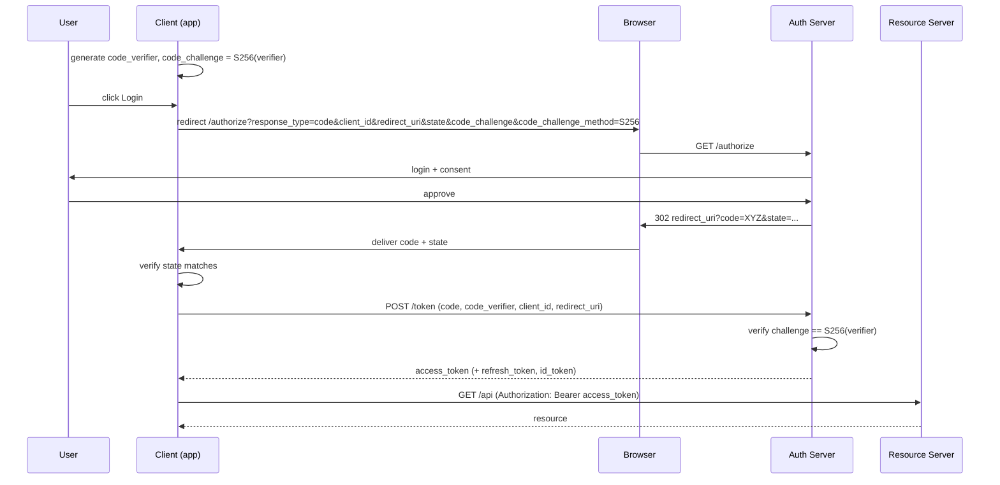

# OAuth 2.0 / OIDC Attacks

Focus on: authorization code flow, redirect_uri handling, state/PKCE, token handling.

## Flow fingerprint

```
GET /authorize?
  response_type=code &
  client_id=abc &
  redirect_uri=https://app.target.com/callback &
  scope=openid profile email &
  state=xyz &
  code_challenge=... &
  code_challenge_method=S256
```

## redirect_uri games

Spec says exact match, many servers are lax.

- **Prefix match** — registered `https://app.target.com/callback`, attacker uses `https://app.target.com.evil.com/callback` or `https://app.target.com/callback/../evil`.
- **Path append** — `/callback` registered, `/callback/../open-redirect?next=evil.com` accepted.
- **Wildcard subdomain** — `*.target.com` → takeover of any subdomain = token theft.
- **Open redirect on target** — if `https://target.com/out?url=X` is whitelisted, chain via `redirect_uri=https://target.com/out?url=https://evil.com`.
- **Path traversal** in redirect parsing.
- **Parameter pollution** — `redirect_uri=legit&redirect_uri=evil`.
- **Fragment injection** — `redirect_uri=https://legit/#/../../evil`.
- **Scheme confusion** — `javascript://legit/%0aalert(1)`.
- **userinfo abuse** — `https://evil.com%23@legit.com/` parses differently per library.

## Auth code interception

- Code returned in URL fragment vs query — fragment leaks less, but referer can leak query.
- Code replay — test if same code used twice returns tokens.
- Code binding — PKCE binds code to device; missing PKCE on public clients = theft-usable.

## state / nonce

- Missing `state` → login CSRF (attacker's account linked to victim's browser).
- Predictable `state` → CSRF still viable.
- `state` reuse across sessions → CSRF window.
- `nonce` missing in OIDC ID token flow → replay.

## PKCE bypass

Some servers accept PKCE params only if present — omit `code_verifier` and token still issues.

```bash
# Start flow with code_challenge, redeem without code_verifier
POST /token
grant_type=authorization_code&code=X&redirect_uri=Y&client_id=Z
# (no code_verifier)
```

## Implicit flow leftovers

`response_type=token` (deprecated) leaks access_token in URL fragment → referer, browser history, logs.

## Client credentials / refresh

- Refresh tokens without rotation → long-lived theft.
- Client secret in public clients (mobile apps, SPAs) — extract from APK / JS bundle.
- `client_id` confusion between public and confidential clients.

## Scope games

- Scope upgrade on refresh — request more scopes than originally granted.
- Scope mismatch between id_token and access_token validation.

## Consent phishing (social)

- Register a rogue OAuth app with target tenant (Microsoft/Google).
- Victim grants `Mail.Read`, `Files.ReadWrite.All`.
- Usually OOS for bounty unless program allows.

## Token validation bugs

Same issues as JWT (see `jwt.md`) — alg confusion, jku spoof, etc. — since ID tokens and access tokens are often JWTs.

## PoC template — redirect_uri bypass

1. Find OAuth flow on `https://app.target.com/login`.
2. Modify `redirect_uri` to attacker-controlled variant.
3. Victim clicks login link; completes auth.
4. Code/token delivered to attacker endpoint.
5. Attacker exchanges code (if needed) → victim session.

## References

- PortSwigger OAuth — https://portswigger.net/web-security/oauth
- OAuth 2.0 Security Best Current Practice — https://datatracker.ietf.org/doc/html/rfc9700
- RFC 6749, RFC 7636 (PKCE), RFC 9207 (iss parameter)
- oauth.tools — https://oauth.tools
- Salt Labs OAuth research — https://salt.security/blog/

## Visual: Authorization Code + PKCE


