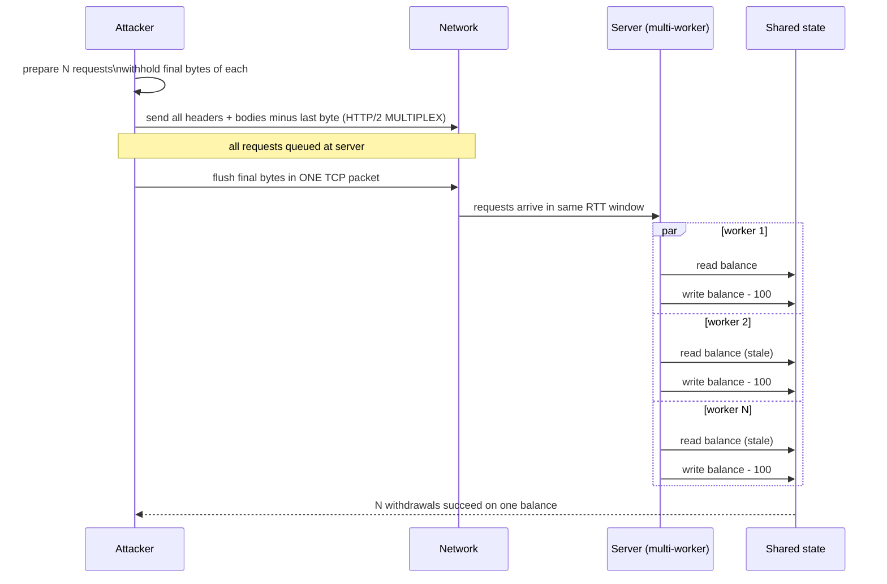

# Race Conditions

TOCTOU and limit-overrun bugs. Best modern tooling: Turbo Intruder + single-packet attack (HTTP/2).

## Target endpoints

- Coupon / gift card redemption (one-time-use → multiple).
- Money transfer, withdrawal, wallet balance.
- 2FA / MFA enrollment flow.
- Invite / signup email verification.
- Rate-limited actions (login, OTP send).
- Vote / like / claim daily reward.
- Purchase of scarce stock.

## Single-packet attack (Kettle, 2023)

Frame multiple HTTP/2 requests in one TCP packet so they arrive simultaneously and are processed in parallel. Works even against jittery cross-regional backends.

Turbo Intruder example:
```python
def queueRequests(target, wordlists):
    engine = RequestEngine(endpoint=target.endpoint,
                           concurrentConnections=1,
                           engine=Engine.BURP2)  # HTTP/2
    for _ in range(30):
        engine.queue(target.req)
    engine.start(timeout=10)

def handleResponse(req, interesting):
    table.add(req)
```

Burp → Repeater → Extension → Turbo Intruder → send; or Burp's built-in "Send group in parallel" (single-packet / last-byte sync) available in Burp 2023.10+.

## Last-byte sync (HTTP/1.1)

- Send all but last byte of N requests.
- Send last byte of all N requests back-to-back.
- Server processes the holding requests nearly simultaneously.

Turbo Intruder's `engine=Engine.THREADED` + `pipeline=True` implements this.

## Validation patterns to find

Bad:
```python
if not user.has_claimed_bonus:
    give_bonus(user)
    user.has_claimed_bonus = True   # race here
```

Good:
```sql
UPDATE users SET has_claimed_bonus = TRUE
WHERE id = $1 AND has_claimed_bonus = FALSE RETURNING id;
-- App checks if row returned
```

Or `SELECT ... FOR UPDATE` inside transaction.

## Multi-endpoint chain races

Race two different endpoints that share state:
- `POST /transfer` and `POST /close-account` together
- `POST /email/verify` and `POST /email/change`
- `POST /apply-coupon` and `POST /remove-coupon`

Turbo Intruder's `engine.queue(req1)` + `engine.queue(req2)` fires them together.

## Reporting race wins

- Send 30 parallel → 2+ successes when business logic says "one" → bug.
- Video PoC showing counter / balance anomaly.
- Quantify impact: $X stolen, Y gift cards redeemed.

## Remediation

- DB-level atomic ops — `UPDATE ... WHERE condition`, constraints, `SELECT FOR UPDATE`.
- Redis `SETNX` / Lua scripts for distributed locks.
- Idempotency keys with `INSERT ... ON CONFLICT DO NOTHING`.
- Avoid app-layer "check then set"; always check-and-set atomically.

## References

- James Kettle — https://portswigger.net/research/smashing-the-state-machine
- Turbo Intruder — https://github.com/PortSwigger/turbo-intruder
- PortSwigger Academy race conditions labs

## Visual: single-packet attack


