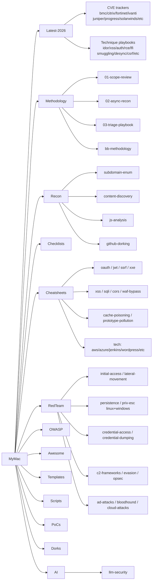

# Index

Flat map of the workbench. Use `grep -rln <term>` across dirs for cross-cutting searches.

**New here?** Read [`START-HERE.md`](START-HERE.md) first.

## Latest-2026 — CVE trackers

- [Tracker README](Latest-2026/README.md) — rolling attack surface index, tags, update log
- [HTTP desync 2025 (Kettle "Must Die")](Latest-2026/desync-2025.md) — James Kettle's 2025 desync research
- [Next.js + framework CVEs](Latest-2026/nextjs-framework-cves.md) — middleware bypass, auth skip, server action abuse
- [Supply chain 2025/2026](Latest-2026/supply-chain.md) — dependency confusion, typosquatting, build pipeline attacks
- [Cloud native — K8s, eBPF, containers](Latest-2026/cloud-native.md) — container escape, K8s RBAC, eBPF abuse
- [Appliance exploit chains](Latest-2026/appliance-chains.md) — VPN/firewall/gateway chained exploits
- [BMC CVEs](Latest-2026/bmc-cves.md) — baseboard management controller vulnerabilities
- [Citrix CVEs](Latest-2026/citrix-cves.md) — Citrix ADC/Gateway/Bleed-class issues
- [Fortinet CVEs](Latest-2026/fortinet-cves.md) — FortiOS/FortiGate auth bypass and RCE
- [Ivanti CVEs](Latest-2026/ivanti-cves.md) — Ivanti Connect Secure/Policy Secure exploits
- [Juniper CVEs](Latest-2026/juniper-cves.md) — Junos OS/SRX/EX vulnerabilities
- [Progress CVEs](Latest-2026/progress-cves.md) — MOVEit, WhatsUp Gold, Telerik
- [SolarWinds CVEs](Latest-2026/solarwinds-cves.md) — SolarWinds Platform/Orion vulns
- [Sourcecodester CVEs](Latest-2026/sourcecodester-cves.md) — PHP CMS SQLi and RCE batch
- [LibreNMS CVEs](Latest-2026/librenms-cves.md) — network monitoring platform vulns
- [SmarterTools CVEs](Latest-2026/smartertools-cves.md) — SmarterMail/SmarterTrack issues
- [Leaflet CVEs](Latest-2026/leaflet-cves.md) — Leaflet.js and mapping library bugs
- [GNU CVEs](Latest-2026/gnu-cves.md) — GNU toolchain and library CVEs
- [Trezor CVEs](Latest-2026/trezor-cves.md) — hardware wallet firmware/protocol bugs
- [Data exfil CVEs](Latest-2026/data-exfil-cves.md) — CVEs with exfiltration as primary impact
- [Tags index](Latest-2026/_tags.md) — cross-reference tags for the tracker

## Latest-2026 — Technique playbooks

- [IDOR techniques](Latest-2026/idor-techniques.md) — object reference substitution, UUID prediction, mass assignment
- [XSS techniques](Latest-2026/xss-techniques.md) — DOM/reflected/stored, filter bypass, CSP evasion, exfil chains
- [Auth bypass techniques](Latest-2026/auth-bypass-techniques.md) — JWT tricks, SSO flaws, step-skip, header injection
- [RCE techniques](Latest-2026/rce-techniques.md) — SSTI, desync-to-RCE, command injection, unsafe deserialization
- [LFI techniques](Latest-2026/lfi-techniques.md) — path traversal, log poisoning, wrapper abuse, RFI fallback
- [HTTP request smuggling](Latest-2026/smuggling-techniques.md) — CL.TE / TE.CL / TE.TE, H2 downgrade, proxy chaining
- [HTTP desync techniques](Latest-2026/desync-techniques.md) — request splitting, connection poisoning, cache deception via desync
- [CSRF techniques](Latest-2026/csrf-techniques.md) — token bypass, SameSite abuse, CORS misconfiguration chains
- [Deserialization techniques](Latest-2026/deserialization-techniques.md) — Java/PHP/Python gadget chains, ysoserial, pickle exploits
- [Race condition techniques](Latest-2026/race-condition-techniques.md) — limit bypass, double-spend, TOCTOU, Turbo Intruder patterns
- [Data exfiltration techniques](Latest-2026/data-exfil-techniques.md) — OOB channels, DNS exfil, blind SQLi extract, covert HTTP
- [Prompt injection techniques](Latest-2026/prompt-injection-techniques.md) — direct/indirect injection, jailbreak, MCP tool poisoning
- [Supply chain techniques](Latest-2026/supply-chain-techniques.md) — typosquatting, dependency confusion, CI/CD hijack
- [Misc techniques](Latest-2026/misc-techniques.md) — framework-specific bugs, middleware bypass, path confusion
- [Open redirect techniques](Latest-2026/open-redirect-techniques.md) — protocol-relative bypass, @-trick, OAuth redirect_uri theft
- [CORS techniques](Latest-2026/cors-techniques.md) — credentialed reflection, null origin, regex bypass, ATO chain
- [Subdomain takeover techniques](Latest-2026/subdomain-takeover-techniques.md) — CNAME fingerprints, claim steps, cookie/OAuth chain
- [SSTI techniques](Latest-2026/ssti-techniques.md) — engine detection, Jinja2/Twig/Freemarker/ERB/SpEL payloads, tplmap

## Methodology

- [01 Scope review](Methodology/01-scope-review.md) — defining in/out of scope, wildcard handling
- [02 Async recon](Methodology/02-async-recon.md) — parallel recon pipeline, tool chaining
- [03 Triage playbook](Methodology/03-triage-playbook.md) — signal vs noise, quick-win filters
- [BB methodology (full)](Methodology/bb-methodology.md) — end-to-end bug bounty process
- [Triage + validation](Methodology/triage-validation.md) — reproducing, impact scoring, dupe check
- [Purple AI (LLM-assisted hunting)](Methodology/PurpleAi.md) — AI-assisted recon and vuln hypothesis
- [Hunting rules](Methodology/rules/hunting.md) — personal rules of engagement for hunts
- [Reporting rules](Methodology/rules/reporting.md) — what to write, how to score, formatting standards

## Recon

- [Subdomain enumeration](Recon/subdomain-enum.md) — passive + active, nuclei, subfinder, amass
- [Content discovery](Recon/content-discovery.md) — feroxbuster, ffuf, wordlist selection
- [JavaScript analysis](Recon/js-analysis.md) — endpoint extraction, secret hunting, webpack
- [GitHub dorking](Recon/github-dorking.md) — code search, token hunting, repo recon
- [Web2 recon playbook](Recon/web2-recon.md) — full web2 recon flow
- [HackSearch queries](Recon/HackSearch.md) — shodan/fofa/censys one-liners

## Checklists — vuln classes

- [Web2 classes](Checklists/vuln-classes/web2.md) — checklist of web2 vuln categories
- [Web3 classes](Checklists/vuln-classes/web3.md) — smart contract vuln categories
- [OWASP testing (long form)](Checklists/OWASPTestingChecklist1.md) — full OWASP WSTG checklist
- [Business logic](Checklists/BusinessLogicErrors.md) — flow manipulation, state skipping, trust abuse
- [Authentication](Checklists/Authentication.md) — login flaws, lockout bypass, session issues
- [Account takeover](Checklists/AccountTakeover.md) · [folder](Checklists/Account%20Takeover/) — ATO vectors
- [2FA bypass](Checklists/2FA%20bypass/) — OTP bypass, backup code abuse, race condition
- [JWT](Checklists/JWTVulnerabilities.md) — alg:none, key confusion, weak secrets
- [Web cache poisoning](Checklists/Web%20Cache%20Poisoning.md) — unkeyed headers, cache key normalization
- [Broken link hijacking](Checklists/BrokenLinkHijacking.md) — subdomain takeover, dead link reclaim
- [Email spoofing](Checklists/EmailSpoofing.md) — SPF/DKIM/DMARC misconfig
- [Exposed API keys](Checklists/ExposedAPIkeys.md) — JS source, git history, headers
- [Forgot password](Checklists/ForgotPasswordFunctionality.md) — token predictability, host header injection
- [Tabnabbing](Checklists/Tabnabbing.md) — reverse tabnabbing via target=_blank
- [Default credentials](Checklists/DefaultCredentials.md) — admin panel discovery and default creds
- [LFI vulnerable targets](Checklists/lfi_vulnerble_targets.md) — known LFI-prone products/paths
- [WordPress endpoints](Checklists/Wordpress%20Endpoints%20to%20look.md) — WP-specific attack surface

## Checklists — API

- [GraphQL](Checklists/API/graphql.md) — introspection, batching, auth bypass
- [REST](Checklists/API/rest.md) — verb tampering, BOLA, mass assignment

## Checklists — Mobile

- [Android](Checklists/Mobile/android.md) — ADB, intent misuse, exported components
- [iOS](Checklists/Mobile/ios.md) — keychain, IPA analysis, URL scheme abuse

## Checklists — Cloud

- [AWS](Checklists/Cloud/aws.md) — IAM, S3, metadata SSRF, lambda misconfig
- [GCP](Checklists/Cloud/gcp.md) — service accounts, GCS, GKE
- [Azure](Checklists/Cloud/azure.md) — managed identity, blob storage, AD misconfig

## Cheatsheets — vuln classes

- [XSS](Cheatsheets/xss.md) — payloads, filter bypass, sink/source reference
- [SQL injection](Cheatsheets/sql-injection.md) — error-based, blind, time-based, OOB
- [SSRF](Cheatsheets/ssrf.md) — internal service access, cloud metadata endpoints
- [XXE](Cheatsheets/xxe.md) — external entity, OOB, blind XXE
- [JWT](Cheatsheets/jwt.md) — signing bypass, claim manipulation
- [OAuth](Cheatsheets/oauth.md) — state fixation, redirect_uri bypass, implicit flow
- [Prototype pollution](Cheatsheets/prototype-pollution.md) — client/server-side, gadget chains
- [Cache poisoning](Cheatsheets/cache-poisoning.md) — unkeyed input attacks, web cache deception
- [WAF bypass](Cheatsheets/waf-bypass.md) — encoding, chunking, header tricks
- [CORS](Cheatsheets/CORS.md) — misconfigured origins, null origin, trusted subdomain
- [CRLF injection](Cheatsheets/CRLF%20Injection.md) — header injection, response splitting
- [CSV injection](Cheatsheets/CSV%20Injection.md) — formula injection in exports
- [Content injection](Cheatsheets/Content%20Injection.md) — reflected/stored content injection
- [Crypto](Cheatsheets/Crypto.md) — weak crypto, padding oracle, IV reuse
- [Template injection](Cheatsheets/Template%20Injection.md) — SSTI by engine (Jinja2, Twig, FreeMarker)
- [XSLT injection](Cheatsheets/XSLT%20Injection.md) — XML/XSLT processor exploitation
- [Open redirect](Cheatsheets/OR.md) — redirect parameter abuse, bypass techniques

## Cheatsheets — tech

- [Apache](Cheatsheets/APACHE.md) — misconfig, .htaccess bypass, mod_rewrite tricks
- [AWS](Cheatsheets/AWS.md) — CLI commands, IAM enum, exploitation patterns
- [Azure](Cheatsheets/AZURE.md) — Az CLI, service principal abuse
- [Cloudflare](Cheatsheets/CLOUDFLARE.md) — origin IP reveal, worker exploitation, WAF bypass
- [Cisco](Cheatsheets/CISCO.md) — IOS vulns, SNMP, default creds
- [Firebase](Cheatsheets/firebase.md) — open rules, data exfil, auth bypass
- [Jenkins](Cheatsheets/JENKINS.md) — script console RCE, credentials exposure
- [Jira](Cheatsheets/JIRA.md) — SSRF, attachment exfil, user enum
- [PostgreSQL](Cheatsheets/PostgreSQL.md) — SQLi specifics, COPY TO/FROM, extensions
- [SharePoint](Cheatsheets/SharePoint.md) — endpoint abuse, anonymous access
- [WordPress](Cheatsheets/WORDPRESS.md) — plugin/theme vulns, xmlrpc, user enum
- [Keyhacks (API key validation)](Cheatsheets/Keyhacks.md) — per-service key validation commands
- [Tools index](Cheatsheets/tools-index.md) — categorized tool list
- [Tools cheatsheet](Cheatsheets/tools.md) — quick-reference tool flags and usage
- [Security arsenal](Cheatsheets/security-arsenal.md) — curated tool stack with usage notes
- [Books](Cheatsheets/books.md) — reading list

## Dorks

- [Google dorks](Dorks/google-dorks.md) — categorized dorks for bug bounty recon
- [LFI passwd dork](Dorks/(LFI)passwrd.md) — LFI-specific search queries

## Payloads

- [403 headers](Payloads/403_header_payloads.txt) — header-based 403 bypass payloads
- [403 URL tricks](Payloads/403_url_payloads.txt) — URL manipulation 403 bypass
- [All files leaked](Payloads/all-files-leaked.txt) — common leaked file paths
- [Spring Boot paths](Payloads/spring-boot.txt) — actuator and framework endpoints
- [JWT secret wordlist](Payloads/jwt-secrets.txt) — common JWT signing secrets
- [WordPress fuzz](Payloads/coffin-wp-fuzz.txt) — WP-specific path wordlist
- [Open redirects](Payloads/or.txt) — open redirect parameter wordlist
- [XSS polyglots](Payloads/xss-polyglots.txt) — cross-context polyglot payloads
- [XSS WAF bypass](Payloads/xss-waf-bypass.txt) — WAF-evasion XSS payloads
- [XSS images](Payloads/xssimage.txt) · [XSS small](Payloads/xss3.txt) — image-based and compact XSS

## Red Team

- [Methodology and phases](RedTeam/methodology-and-phases.md) — red team op lifecycle
- [Initial access](RedTeam/initial-access.md) — phishing, public exploits, supply chain entry
- [Web exploitation](RedTeam/web-exploitation.md) — web-specific initial access techniques
- [C2 frameworks](RedTeam/c2-frameworks.md) — Cobalt Strike, Sliver, Havoc, C2 matrix
- [Lateral movement](RedTeam/lateral-movement.md) — pass-the-hash, WMI, SMB, RDP
- [Persistence — Linux](RedTeam/persistence-linux.md) — cron, rc.local, LD_PRELOAD, systemd
- [Persistence — Windows](RedTeam/persistence-windows.md) — registry, scheduled tasks, services, WMI subscriptions
- [Privilege escalation — Linux](RedTeam/priv-esc-linux.md) — SUID, sudo misconfig, kernel exploits
- [Privilege escalation — Windows](RedTeam/priv-esc-windows.md) — token abuse, AlwaysInstallElevated, UAC bypass
- [Credential access](RedTeam/credential-access.md) — credential hunting techniques
- [Credential dumping](RedTeam/credential-dumping.md) — LSASS, SAM, NTDS, DCSync
- [Mimikatz](RedTeam/mimikatz.md) — command reference, token manipulation, golden ticket
- [Active Directory attacks](RedTeam/ad-attacks.md) — Kerberoasting, AS-REP, BloodHound paths
- [BloodHound](RedTeam/bloodhound.md) — collection, queries, attack path analysis
- [Cloud attacks](RedTeam/cloud-attacks.md) — AWS/Azure/GCP red team techniques
- [Evasion](RedTeam/evasion.md) — AV/EDR bypass, AMSI, obfuscation
- [OPSEC](RedTeam/opsec.md) — bug bounty OPSEC, attribution risk, anonymity
- [OSINT](RedTeam/osint.md) — subdomain enum, person recon, infrastructure mapping
- [Network scanning](RedTeam/network-scanning.md) — nmap, masscan, port survey workflows
- [Metasploit](RedTeam/metasploit.md) — module selection, payload staging, post-exploitation
- [Exfiltration](RedTeam/exfil.md) — data staging, encoding, covert channels
- [File system ops](RedTeam/file-ops.md) — collection, compression, timestomping
- [Wireless attacks](RedTeam/wireless-attacks.md) — WPA handshake capture, evil twin, deauth
- [Snort rules](RedTeam/snort-rules.md) — detection rule writing and usage

## Cloudflare WAF bypass

- [Twitter thread notes](Cloudflare-WAF-Bypass/twitter1.md) — community bypass threads
- [XSS bypass 1](Cloudflare-WAF-Bypass/xss1.md) — Cloudflare-specific XSS evasion

## PoCs / CVEs

- [CVE-2021-36873](PoCs/CVES/CVE-2021-36873.md) — WordPress Rank Math RCE
- [CVE-2024-0195](PoCs/CVES/CVE-2024-0195/) — SpiderFlow RCE
- [CVE-2024-29269 RCE](PoCs/CVES/CVE-2024-29269-RCE/) — Telesquare RCE
- [CVE-2024-2876 SQLi](PoCs/CVES/BreadcrumbsSQL_Injection_cve_2024/) — Breadcrumbs NavXT SQLi

## OWASP

- [OWASP testing guide checklist](OWASP/Checklist/OWASP%20Web%20Application%20Security%20Testing.md) — full WSTG checklist
- [Top 10 README](OWASP/TOP10/README.md) — OWASP Top 10 summary
- [Projects README](OWASP/Projects/README.md) — notable OWASP project links

## Templates

- [Report writing](Templates/report-writing.md) — bug report template and scoring guidance
- [Target notes](Templates/target_notes.md) — per-target session template

## Scripts

- [403 bypass script](Scripts/403-ByPass.md) — notes on 403 bypass tooling
- [Chat bot XSS payloads](Scripts/Chat-bot_xss_payloads.md) — XSS payloads targeting chatbot interfaces
- [Polyglot notes](Scripts/polyglot.md) — polyglot payload generation notes

## Burp

- [Burp readme](Burp/readme.md) — configs, match/replace rules, extension notes

## AI

- [LLM security](AI/llm-security.md) — prompt injection, model abuse, MCP attack surface, CVEs
- [AI links](AI/links/readme.md) — curated LLM/agent security links

## Infosec

- [Automation notes](Infosec/automation.md) — recon pipeline automation ideas
- [Infosec readme](Infosec/readme.md) — infosec reference index

## Notes

- [Writeups 2026](Notes/writeups-2026.md) — writeup reading log and technique extracts

## Root

- [Links master index](Links.md) — 1,300+ references
- [Targets notes](Targets.md) — active target list and notes
- [Bug quick notes](bug.md) — scratch notes on live bugs

## Visual: repo topology

