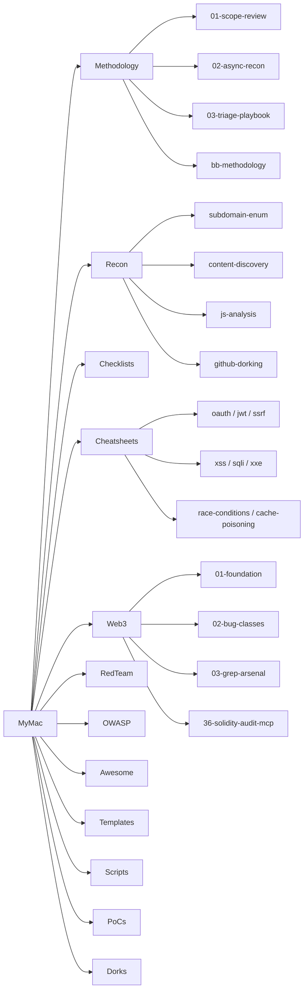

# Index

Flat map of the workbench. Use `grep -rln <term>` across dirs for cross-cutting searches.

**New here?** Read [`START-HERE.md`](START-HERE.md) first.

## Latest (2025/2026)
- [Latest-2026 tracker](Latest-2026/README.md)
- [HTTP desync 2025 (Kettle "Must Die")](Latest-2026/desync-2025.md)
- [Next.js + framework CVEs](Latest-2026/nextjs-framework-cves.md)
- [Supply chain 2025/2026](Latest-2026/supply-chain.md)
- [Cloud native — K8s, eBPF, containers](Latest-2026/cloud-native.md)
- [Appliance exploit chains](Latest-2026/appliance-chains.md)
- [LLM + agent + MCP security](AI/llm-security.md)

## Methodology
- [01 Scope review](Methodology/01-scope-review.md)
- [02 Async recon](Methodology/02-async-recon.md)
- [03 Triage playbook](Methodology/03-triage-playbook.md)
- [BB methodology (full)](Methodology/bb-methodology.md)
- [Triage + validation](Methodology/triage-validation.md)
- [Purple AI (LLM-assisted hunting)](Methodology/PurpleAi.md)

## Recon
- [Subdomain enumeration](Recon/subdomain-enum.md)
- [Content discovery](Recon/content-discovery.md)
- [JavaScript analysis](Recon/js-analysis.md)
- [GitHub dorking](Recon/github-dorking.md)
- [Web2 recon playbook](Recon/web2-recon.md)
- [HackSearch queries](Recon/HackSearch.md)

## Checklists — vuln classes
- [Web2 classes](Checklists/vuln-classes/web2.md)
- [Web3 classes](Checklists/vuln-classes/web3.md)
- [OWASP testing (long form)](Checklists/OWASPTestingChecklist1.md)
- [Business logic](Checklists/BusinessLogicErrors.md)
- [Authentication](Checklists/Authentication.md)
- [Account takeover](Checklists/AccountTakeover.md) · [folder](Checklists/Account%20Takeover/)
- [2FA bypass](Checklists/2FA%20bypass/)
- [JWT](Checklists/JWTVulnerabilities.md)
- [Web cache poisoning](Checklists/Web%20Cache%20Poisoning.md)
- [Broken link hijacking](Checklists/BrokenLinkHijacking.md)
- [Email spoofing](Checklists/EmailSpoofing.md)
- [Exposed API keys](Checklists/ExposedAPIkeys.md)
- [Forgot password](Checklists/ForgotPasswordFunctionality.md)
- [Tabnabbing](Checklists/Tabnabbing.md)
- [Default credentials](Checklists/DefaultCredentials.md)
- [LFI vulnerable targets](Checklists/lfi_vulnerble_targets.md)
- [WordPress endpoints](Checklists/Wordpress%20Endpoints%20to%20look.md)

## Checklists — API
- [GraphQL](Checklists/API/graphql.md)
- [REST](Checklists/API/rest.md)

## Checklists — Mobile
- [Android](Checklists/Mobile/android.md)
- [iOS](Checklists/Mobile/ios.md)

## Checklists — Cloud
- [AWS](Checklists/Cloud/aws.md)
- [GCP](Checklists/Cloud/gcp.md)
- [Azure](Checklists/Cloud/azure.md)

## Cheatsheets — vuln classes
- [XSS](Cheatsheets/xss.md)
- [SQL injection](Cheatsheets/sql-injection.md)
- [SSRF](Cheatsheets/ssrf.md)
- [XXE](Cheatsheets/xxe.md)
- [JWT](Cheatsheets/jwt.md)
- [OAuth](Cheatsheets/oauth.md)
- [Prototype pollution](Cheatsheets/prototype-pollution.md)
- [Race conditions](Cheatsheets/race-conditions.md)
- [Cache poisoning](Cheatsheets/cache-poisoning.md)
- [Deserialization](Cheatsheets/deserialization.md)
- [WAF bypass](Cheatsheets/waf-bypass.md)
- [CORS](Cheatsheets/CORS.md)
- [CRLF injection](Cheatsheets/CRLF%20Injection.md)
- [CSV injection](Cheatsheets/CSV%20Injection.md)
- [Content injection](Cheatsheets/Content%20Injection.md)
- [RCE](Cheatsheets/RCE.md)
- [LFI](Cheatsheets/LFI.md)
- [Crypto](Cheatsheets/Crypto.md)
- [Template injection](Cheatsheets/Template%20Injection.md)
- [XSLT injection](Cheatsheets/XSLT%20Injection.md)
- [Open redirect](Cheatsheets/OR.md)

## Cheatsheets — tech
- [Apache](Cheatsheets/APACHE.md)
- [AWS](Cheatsheets/AWS.md)
- [Azure](Cheatsheets/AZURE.md)
- [Cloudflare](Cheatsheets/CLOUDFLARE.md)
- [Cisco](Cheatsheets/CISCO.md)
- [Firebase](Cheatsheets/firebase.md)
- [Jenkins](Cheatsheets/JENKINS.md)
- [Jira](Cheatsheets/JIRA.md)
- [PostgreSQL](Cheatsheets/PostgreSQL.md)
- [SharePoint](Cheatsheets/SharePoint.md)
- [WordPress](Cheatsheets/WORDPRESS.md)
- [Keyhacks (API key validation)](Cheatsheets/Keyhacks.md)
- [Tools index](Cheatsheets/tools-index.md)
- [Security arsenal](Cheatsheets/security-arsenal.md)
- [Red team cheatsheets](Cheatsheets/Redteam.md)
- [Recon cheatsheet](Cheatsheets/Recon.md)
- [Books](Cheatsheets/books.md)

## Payloads
- [403 headers](Payloads/403_header_payloads.txt)
- [403 URL tricks](Payloads/403_url_payloads.txt)
- [All files leaked](Payloads/all-files-leaked.txt)
- [Spring Boot paths](Payloads/spring-boot.txt)
- [JWT secret wordlist](Payloads/jwt-secrets.txt)
- [WordPress fuzz](Payloads/coffin-wp-fuzz.txt)
- [Open redirects](Payloads/or.txt)
- [XSS polyglots](Payloads/xss-polyglots.txt)
- [XSS WAF bypass](Payloads/xss-waf-bypass.txt)
- [XSS images](Payloads/xssimage.txt) · [XSS small](Payloads/xss3.txt)

## Burp
- [Readme (configs, match/replace, extensions)](Burp/readme.md)

## Cloudflare WAF bypass
- [Twitter thread notes](Cloudflare-WAF-Bypass/twitter1.md)
- [XSS bypass 1](Cloudflare-WAF-Bypass/xss1.md)
- [XSS bypass 2](Cloudflare-WAF-Bypass/xss2)

## PoCs / CVEs
- [CVE-2021-36873](PoCs/CVES/CVE-2021-36873.md)
- [CVE-2024-0195](PoCs/CVES/CVE-2024-0195/)
- [CVE-2024-29269 RCE](PoCs/CVES/CVE-2024-29269-RCE/)
- [CVE-2024-2876 SQLi](PoCs/CVES/SQL_Injection_cve_2024/)

## Red Team
- [OPSEC (bug bounty)](RedTeam/OPSEC.md)
- [Methodology + phases](RedTeam/methodology-and-phases.md)
- [C2 frameworks](RedTeam/C2_Frameworks.md) · [C2 interaction](RedTeam/C2_Interaction.md)
- [Linux persistence](RedTeam/Linux_Persistence.md) · [Linux privesc](RedTeam/Linux_PrivEsc.md)
- [Windows persistence](RedTeam/Windows_Persistence.md) · [Windows privesc](RedTeam/Windows_PrivEsc.md)
- [Lateral movement](RedTeam/Lateral_Movement.md)
- [OS credential dumping](RedTeam/OS_Credential_Dumping.md)
- [Mimikatz](RedTeam/Mimikatz.md) · [Metasploit](RedTeam/Metasploit.md) · [Nmap](RedTeam/Nmap.md)
- [Web exploitation](RedTeam/Web_Exploitation.md)
- [Network scanning](RedTeam/Network_Scanning.md)
- [Wireless attacks](RedTeam/Wireless_Attacks.md)
- [Data exfiltration](RedTeam/Data_Exfiltration.md)
- [File system ops](RedTeam/File_System_Operations.md)
- [OSINT](RedTeam/OSINT.md) · [Snort rules](RedTeam/Snort_Rules.md)

## Web3
- [Start here](Web3/00-START-HERE.md)
- [01 Foundation](Web3/01-foundation.md)
- [02 Bug classes](Web3/02-bug-classes.md)
- [03 Grep arsenal](Web3/03-grep-arsenal.md)
- [04 PoC + Foundry](Web3/04-poc-and-foundry.md)
- [05 Triage + report](Web3/05-triage-report-examples.md)
- [06 Methodology research](Web3/06-methodology-research.md)
- [07 Role misconfig case](Web3/07-case-study-role-misconfiguration.md)
- [08 AI tools](Web3/08-ai-tools.md)
- [09 Live hunt zkSync](Web3/09-live-hunt-zksync.md)
- [36 Solidity audit MCP](Web3/36-solidity-audit-mcp.md)

## Templates
- [Report writing](Templates/report-writing.md)
- [Target notes](Templates/target_notes.md)

## Notes
- [Bug bounty workflows](Notes/bug-bounty-workflows.md)
- [Methodologies](Notes/methodologies.md)
- [Reconnaissance](Notes/reconnaissance.md)
- [Quick commands](Notes/quick-commands.md)
- [Tools + commands](Notes/tools-and-commands.md)
- [Web vulnerabilities](Notes/web-vulnerabilities.md)
- [Payloads + bypasses](Notes/payloads-and-bypasses.md)
- [Google dorking](Notes/google-dorking.md)
- [Bug bounty organized](Notes/bug_bounty_organized.md)

## OWASP
- [Checklist](OWASP/Checklist/)
- [Top 10](OWASP/TOP10/)
- [Projects](OWASP/Projects/)

## Scripts
- [Automation](Scripts/Automation/)
- [Bookmarks](Scripts/Bookmarks/)
- [Resources](Scripts/resources/)

## Awesome lists
- [Bug bounty](Awesome/Awesome%20Bug%20Bounty%20Tips%20Awesome.md) · [Writeups](Awesome/Awesome-Bugbounty-Writeups.md)
- [Tools](Awesome/Awesome%20Tool.md) · [One-liners](Awesome/Awesome%20One-liner%20Bug%20Bounty%20Awesome.md)
- [Hacker search engines](Awesome/awesome-hacker-search-engines.md) · [Shodan](Awesome/Awesome%20Shodan.md)
- [WAF](Awesome/Awesome%20WAF%20Awesome.md) · [Keys](Awesome/Awesome%20Keys.md)
- [Web3 security](Awesome/Awesome-web3-Security%20awesome.md)
- Full list: [Awesome/](Awesome/)

## Dorks
- [LFI passwd dork](Dorks/(LFI)passwrd.md)

## AI
- [AI links](AI/links/readme.md)

## Infosec
- [Automation notes](Infosec/automation.md)

## Root
- [Links master index](Links.md) (1,300+ references)
- [Targets notes](Targets.md)
- [Bug quick notes](bug.md)

## Visual: repo topology

