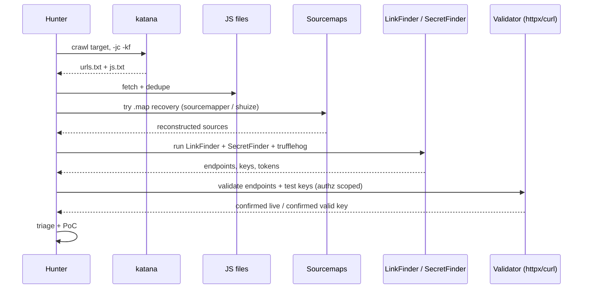

# JavaScript Analysis

JS bundles leak endpoints, API keys, internal hostnames, feature flags, and (rarely) credentials.

## Collect JS

```bash
# From crawl
katana -u https://target.com -d 3 -jc -silent \
  | grep -Ei '\.js(\?|$)' | sort -u > js.txt

# From historical
gau --subs target.com | grep -Ei '\.js(\?|$)' | sort -u >> js.txt
waybackurls target.com | grep -Ei '\.js(\?|$)' | sort -u >> js.txt
sort -u -o js.txt js.txt

# Probe live
httpx -l js.txt -mc 200 -sr -srd js-body/
```

## Sourcemap recovery

```bash
# If .js.map is accessible — original source returns
for u in $(cat js.txt); do
  curl -s "$u.map" -o "$(basename $u).map" 2>/dev/null
done

# Recover sources
npx sourcemapper -output recovered/ -url https://target.com/app.js.map
```

## Endpoint extraction

```bash
# LinkFinder — regex + AST for endpoints
python3 linkfinder.py -i https://target.com/app.js -o cli | tee endpoints.txt

# Batch via GetJS + LinkFinder
getJS --url https://target.com --complete \
  | while read j; do python3 linkfinder.py -i "$j" -o cli; done \
  | sort -u > all-endpoints.txt

# Simpler: grep approach (noisy but quick)
grep -oE '["\x27]/[a-zA-Z0-9_\-/\.]+["\x27]' js-body/*.js \
  | tr -d '"'"'" | sort -u
```

## Secret hunting

```bash
# TruffleHog (git + filesystem + url)
trufflehog filesystem js-body/ --only-verified

# Gitleaks
gitleaks detect --source js-body/ -r gitleaks.json --no-git

# Mantra / SecretFinder
python3 SecretFinder.py -i https://target.com/app.js -o cli
```

High-value patterns:
- `AIza[0-9A-Za-z_\-]{35}` — Google API keys
- `AKIA[0-9A-Z]{16}` — AWS Access Key ID
- `sk_live_[0-9a-zA-Z]{24,}` — Stripe live
- `ghp_[A-Za-z0-9]{36}` — GitHub PAT
- `xox[baprs]-[A-Za-z0-9\-]{10,}` — Slack tokens
- `firebaseio\.com` / `firebaseapp\.com` — then probe `.json` endpoints

Validate before reporting (see `Cheatsheets/Keyhacks.md`).

## Webpack tricks

- `webpackChunkName` comments → original module names
- `__webpack_require__` call graph → module IDs
- Chunk hash changes between deploys — re-scan on deploy cadence
- Split vendor chunks often contain the sensitive app logic

## Framework-specific

- Next.js — `/_next/static/chunks/`, `_buildManifest.js`, `_ssgManifest.js`, `*.json` data files under `/_next/data/<build>/`.
- Nuxt — `window.__NUXT__`, `/_nuxt/static/<ts>/` for SSR data dumps.
- SPA with route maps — grep for `createBrowserRouter`, `createRouter`, `path:`, routing tables.

## Output flow

- Endpoints → content-discovery + API checklists
- Hostnames → back to subdomain enum
- Keys → `Cheatsheets/Keyhacks.md` for validation
- Feature flags → ideas for hidden/beta routes

## References

- LinkFinder — https://github.com/GerbenJavado/LinkFinder
- SecretFinder — https://github.com/m4ll0k/SecretFinder
- Mantra — https://github.com/MrEmpy/Mantra
- sourcemapper — https://github.com/denandz/sourcemapper

## Visual: JS analysis sequence


