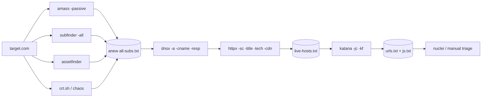

# Subdomain Enumeration

Passive → resolve → active brute → permutation → live probe.

## Passive

```bash
# Aggregators (no target packets)
subfinder -d target.com -all -recursive -silent -o sf.txt
amass enum -passive -d target.com -o am.txt
assetfinder --subs-only target.com > af.txt
findomain -t target.com -q > fd.txt

# CT logs directly
curl -s "https://crt.sh/?q=%25.target.com&output=json" \
  | jq -r '.[].name_value' | tr ',' '\n' | sort -u > crt.txt

# Wayback / CommonCrawl derived
gau --subs target.com | unfurl -u domains | sort -u > gau-domains.txt
waybackurls target.com | unfurl -u domains | sort -u > wb-domains.txt

# Chaos (PD's curated dataset — free with token)
chaos -d target.com -silent -o chaos.txt
```

Sources behind subfinder (review `~/.config/subfinder/provider-config.yaml`):
virustotal · securitytrails · shodan · censys · github · bevigil · fofa · binaryedge · dnsdumpster · hackertarget · anubis · threatbook · whoisxml · bufferover · passivetotal.

## Resolve

```bash
cat sf.txt am.txt af.txt fd.txt crt.txt chaos.txt | sort -u > all-raw.txt

# Wildcard-safe resolution
dnsx -l all-raw.txt -r resolvers.txt -wd target.com -a -resp-only -silent -o resolved.txt

# Massdns (faster for large lists)
massdns -r resolvers.txt -t A -o S -w massdns.out all-raw.txt
```

Fresh resolvers:
```bash
curl -s https://public-dns.info/nameservers-all.txt | \
  dnsvalidator --threads 50 -o resolvers.txt
```

## Active brute

```bash
# Short list first
shuffledns -d target.com -w subdomains-top1million-110000.txt \
  -r resolvers.txt -o brute.txt

# Permutations (altdns / gotator / ripgen)
gotator -sub resolved.txt -perm permutations.txt -depth 1 -numbers 3 -mindup \
  | shuffledns -d target.com -r resolvers.txt -o perms.txt
```

## HTTP probe

```bash
httpx -l resolved.txt -threads 100 -rate-limit 150 \
  -sc -title -tech-detect -cdn -location \
  -json -o httpx.json

jq -r '.url' httpx.json | sort -u > live.txt
```

## Takeover scan

```bash
subzy run --targets live.txt --hide_fails
nuclei -l live.txt -tags takeover -severity high,critical
```

## Output flow

- `resolved.txt` → next stage (content discovery)
- `httpx.json` → tech-sorted pivots (WordPress, Jenkins, Jira buckets)
- `takeover.txt` → submit immediately if confirmed

## API-based passive sources (direct curl)

Supplement subfinder with these when you want raw output without tool overhead:

```bash
# RapidDNS
export host="TARGET"; curl -s "https://rapiddns.io/subdomain/$host?full=1#result" | grep -e "<td>.*$host</td>" | grep -oP '(?<=<td>)[^<]+' | sort -u

# BufferOver (FDNS)
curl -s https://dns.bufferover.run/dns?q=.TARGET.com | jq -r .FDNS_A[] | cut -d',' -f2 | sort -u

# BufferOver (TLS)
export domain="TARGET"; curl "https://tls.bufferover.run/dns?q=$domain" | jq -r .Results'[]' | rev | cut -d ',' -f1 | rev | sort -u | grep "\.$domain"

# JLDC
curl -s "https://jldc.me/anubis/subdomains/TARGET" | grep -Po "((http|https):\/\/)?(([\w.-]*)\.([\w]*)\.([A-z]))\w+" | sort -u

# Sonar
curl --silent https://sonar.omnisint.io/subdomains/TARGET | grep -oE "[a-zA-Z0-9._-]+\.TARGET" | sort -u

# CertSpotter v1
curl -s "https://certspotter.com/api/v1/issuances?domain=TARGET&include_subdomains=true&expand=dns_names" | jq .[].dns_names | grep -Po "(([\w.-]*)\.([\w]*)\.([A-z]))\w+" | sort -u

# Wayback Machine derived
curl -s "http://web.archive.org/cdx/search/cdx?url=*.TARGET/*&output=text&fl=original&collapse=urlkey" | sed -e 's_https*://__' -e "s/\/.*//" | sort -u
```

## DNS-over-HTTPS bruteforce

Resolve subdomains via Google DNS-over-HTTPS API — bypasses local resolver blocks:

```bash
while read sub; do
  echo "https://dns.google.com/resolve?name=$sub.TARGET&type=A&cd=true" | \
    parallel -j100 -q curl -s -L --silent | \
    grep -Po '[{\[]{1}([,:{}\[\]0-9.\-+Eaeflnr-u \n\r\t]|".*?")+[}\]]{1}' | \
    jq | grep "name" | grep -Po "((http|https):\/\/)?(([\w.-]*)\.([\w]*)\.([A-z]))\w+" | \
    grep ".TARGET" | sort -u
done < wordlist.txt
```

## Shodan / SQRY queries for subdomain and asset discovery

```bash
# SSL cert SAN — finds subdomains not in passive DNS
shodan search 'ssl.cert.subject.cn:"target.com"' --fields ip_str | httpx -sc -title -server

# SQRY wrapper (install: go install github.com/kdairatchi/sqry@latest)
sqry -q "ssl:true" --domains --with-domains
sqry --cve CVE-2016-10087 --cve-json --pretty
sqry --min-cvss 9.0 --max-cvss 10.0 --json
sqry --kev --json --limit 10

# ASN → IP ranges via RADB whois
whois -h whois.radb.net -i origin -T route \
  $(whois -h whois.radb.net TARGET_IP | grep origin: | awk '{print $NF}' | head -1) | \
  grep -w "route:" | awk '{print $NF}' | sort -n
```

## LazyHunter (CVE + port analysis)

```bash
hunter.py --cve+ports --target <target_ip> --json-output results.json
hunter.py --cve+ports --target targets.txt --json-output bulk_scan.json
hunter.py --host --ports --target <target_ip> --json-output quick_scan.json
hunter.py --cve+ports --target <target_ip> --threads 20 --timeout 60
```

## Custom wordlist from target URL tokens

Build a domain-specific wordlist from URLs already discovered — higher hit rate than generic SecLists:

```bash
# Extract URL keys and paths, merge into a deduplicated wordlist
gau HOST | unfurl -u keys | tee -a wordlist.txt
gau HOST | unfurl -u paths | tee -a paths.txt
sed 's#/#\n#g' paths.txt | sort -u | tee -a wordlist.txt | sort -u
rm paths.txt
sed -i -e 's/\.css\|\.png\|\.jpeg\|\.jpg\|\.svg\|\.gif\|\.wolf\|\.bmp//g' wordlist.txt

# Token-based wordlist from live responses
cat HOSTS.txt | httprobe | xargs curl | tok | tr '[:upper:]' '[:lower:]' | sort -u | tee -a wordlist.txt
```

## References

- TrickestSec subdomain-enum playbook — https://github.com/trickest/resolvers
- ProjectDiscovery docs — https://docs.projectdiscovery.io
- SecLists subdomains — https://github.com/danielmiessler/SecLists

## Visual: pipeline


