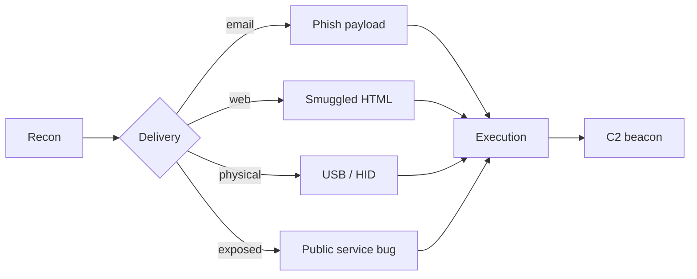

# Initial Access

Framing: authorized engagements and bug bounty in-scope work only. This covers how initial access is typically obtained so defenders and researchers can recognise, simulate, and detect it.

## Threat model

Initial access is the first foothold. Sources for MITRE ATT&CK TA0001 techniques: https://attack.mitre.org/tactics/TA0001/.

The typical vectors in a modern engagement:

1. Phishing (spear, clone, or conversation hijack)
2. Exposed external service (bug bounty scope — web app, API, VPN portal)
3. Malicious document / HTML smuggling delivery
4. Removable media (USB drop, HID attack) — rare, physical assessments only
5. Supply chain (trusted update channel, dependency)



## Phishing infrastructure

Standard pattern for a sanctioned red team: aged domain + categorised + legitimate TLS + mail auth.

- Domain acquisition: expired/aged from ExpiredDomains.net; verify reputation with `urlscan.io`, VirusTotal, and an SPF/DMARC history lookup.
- Mail stack: Postfix + OpenDKIM + OpenDMARC. Publish SPF (`v=spf1 mx ~all`), DKIM (2048-bit), and DMARC (`p=quarantine`). Mail-Tester (https://www.mail-tester.com/) should score 9+/10 before any send.
- Web stack: nginx + Let's Encrypt via acme.sh. Geo/UA/referer filter at the edge; only allow target ASN/geo.
- Redirector: separate VPS between the sender landing and C2, so the C2 is never exposed directly. See https://github.com/taherio/redi or nginx `proxy_pass` with allowlists.

Reference frameworks (pick one, don't stack):

- Gophish — phishing campaign management, open source. https://github.com/gophish/gophish
- Evilginx3 — reverse-proxy AITM for MFA capture. Use only where engagement lets, and document fully. https://github.com/kgretzky/evilginx2
- King Phisher — deprecated but still referenced. https://github.com/rsmusllp/king-phisher

Send cadence: warm the domain for 7–14 days with legitimate traffic before any campaign. Hetzner/DigitalOcean IPs are burned — use dedicated SMTP (Mailgun, SendGrid) with domain reputation you built, or self-hosted with warmed IP.

## Payload delivery

Typical delivery containers, in rough order of current success against managed endpoints:

- `.lnk` inside ISO / IMG / VHD (MOTW-aware since Windows 10 22H2; still effective when signed)
- Signed installer (MSI, MSIX) with sideloading DLL
- OneNote `.one` with embedded script (patched by default May 2023, but older tenants lag)
- HTML smuggling (JS blob assembled in-browser, bypasses some mail inspection)
- Office macros are largely dead since Microsoft's default block (Feb 2022). Don't waste a campaign on them.

Reference: Red Canary Threat Detection Report, annual — https://redcanary.com/threat-detection-report/.

### HTML smuggling

Concept: deliver a benign HTML that assembles the final artifact in the browser with a Blob + `a.download`. Microsoft write-up: https://www.microsoft.com/en-us/security/blog/2021/11/11/html-smuggling-surges-highly-evasive-loader-technique-increasingly-used-in-banking-malware-targeted-attacks/.

Defensive detection: CSP, `Content-Disposition` scanning at mail gateway, browser extension blocking `download` attribute on untrusted origins.

### Tooling

- Nim/Go/Rust loaders to avoid AV signatures on .NET/PS. Reference patterns only — see Outflank's public research: https://outflank.nl/blog/.
- Payload generators: msfvenom (noisy), Donut (https://github.com/TheWover/donut), sRDI (https://github.com/monoxgas/sRDI).
- Sandbox evasion should rely on environmental keying, not generic VM checks. See al-khaser for a catalogue: https://github.com/LordNoteworthy/al-khaser.

## Exposed external service (bug bounty path)

For bug bounty this is almost always the real vector. Recon → vuln → limited RCE PoC → report.

Standard flow:

```
subfinder -d target.tld -all | httpx -silent -sc -td -title -tls-grab | tee hosts.txt
nuclei -l hosts.txt -severity critical,high -tags rce,ssrf,sqli
```

Common initial footholds discovered in bounties:

- Unauthenticated RCE in forgotten appliances (Jenkins, GitLab, Confluence, MOVEit)
- SSRF → cloud metadata (see `cloud-attacks.md`)
- Template injection in reporting / dashboard features
- Deserialization in legacy Java endpoints
- Path traversal in upload handlers

Always stop at proof. Do not pivot, do not run privilege escalation, do not access other customer data. Snapshot the response, redact, report.

## USB / HID

Only on physical-assessment engagements where the SOW authorises it.

- Rubber Ducky / Flipper Zero — keystroke injection. https://docs.hak5.org/hak5-usb-rubber-ducky
- O.MG cables — covert HID. https://o.mg.lol/
- BadUSB firmware on commodity drives — rare, loud, brittle.

Defensive controls: BitLocker + USB device control GPO + Attack Surface Reduction rule "Block untrusted and unsigned processes that run from USB" (`b2b3f03d-6a65-4f7b-a9c7-1c7ef74a9ba4`). Reference: https://learn.microsoft.com/en-us/defender-endpoint/attack-surface-reduction-rules-reference.

## Supply chain

Compromise an upstream package, CI token, or vendor. Real-world references: SolarWinds (2020), 3CX (2023), xz-utils (CVE-2024-3094).

For bounty: look for leaked CI tokens in public GitHub, stale NPM packages the target depends on, typo-squats. Tools: trufflehog, gitleaks, Socket.dev.

## Detection signals (blue team cross-check)

- Uncommon parent-child: `winword.exe → cmd.exe`, `outlook.exe → powershell.exe`
- LNK / ISO mounts from Downloads folder
- First-time signed binary executing from user profile
- DNS to newly-registered domain with low reputation
- `mshta.exe`, `rundll32.exe` with remote URL args

Log source minimums: Sysmon (config https://github.com/SwiftOnSecurity/sysmon-config), Windows Defender ATP, EDR telemetry, mail gateway, proxy, DNS.

## References

- MITRE ATT&CK TA0001 — https://attack.mitre.org/tactics/TA0001/
- Red Canary Threat Detection Report — https://redcanary.com/threat-detection-report/
- MITRE's Initial Access data sources — https://attack.mitre.org/datasources/
- Microsoft macro block announcement — https://techcommunity.microsoft.com/t5/microsoft-365-blog/helping-users-stay-safe-blocking-internet-macros-by-default-in/ba-p/3071805
