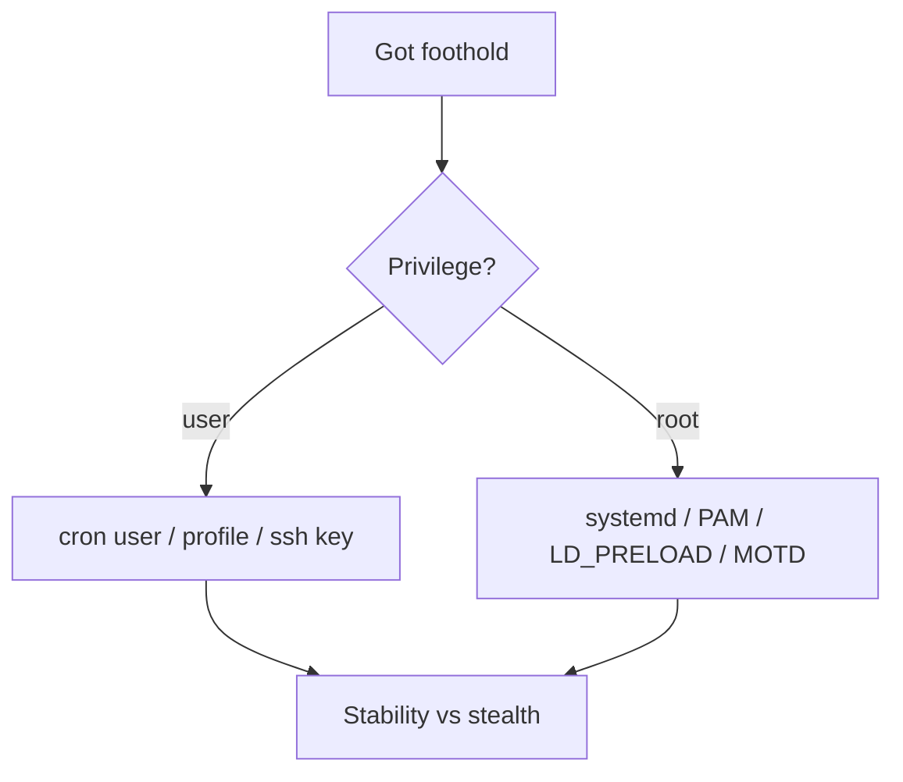

# Persistence — Linux

For authorized engagements. Clean up every mechanism you plant before the engagement closes; document each in the report.

MITRE reference: https://attack.mitre.org/tactics/TA0003/ (filter platform=Linux).

## Selection



Quiet mechanisms survive `chkrootkit` and `rkhunter` but not thorough review. No persistence is invisible to a determined responder with a baseline.

## 1. Cron

User cron:

```
crontab -e
* * * * * /home/user/.cache/updater >/dev/null 2>&1
```

System cron (root): `/etc/cron.d/NAME`, `/etc/cron.{hourly,daily,weekly,monthly}/`. Files must be `0644`, owned by root, no extension.

Detection: `auditd` watch on `/etc/cron*`, `~/.crontab`. Sigma: https://github.com/SigmaHQ/sigma/tree/master/rules/linux.

## 2. systemd service

`/etc/systemd/system/updater.service`:

```
[Unit]
Description=System update helper
After=network.target

[Service]
Type=simple
ExecStart=/usr/local/sbin/updater
Restart=on-failure
RestartSec=60

[Install]
WantedBy=multi-user.target
```

```
systemctl daemon-reload
systemctl enable --now updater.service
```

User-scope variant: `~/.config/systemd/user/NAME.service` + `loginctl enable-linger user`.

Detection: auditd on `/etc/systemd/system/`, `systemd-analyze security NAME`, diffing `systemctl list-unit-files` against baseline.

## 3. systemd timer

Replaces cron for newer distros.

`/etc/systemd/system/updater.timer`:

```
[Unit]
Description=Run updater

[Timer]
OnBootSec=2min
OnUnitActiveSec=1h
Unit=updater.service

[Install]
WantedBy=timers.target
```

## 4. LD_PRELOAD

Root-only (global) via `/etc/ld.so.preload`. A path listed there is loaded into every dynamically-linked process. Trivially defeated by `strace`, `auditctl -w /etc/ld.so.preload`, `ldd`, or any responder that reads the file.

User-scope: export `LD_PRELOAD=/path/to/lib.so` in `~/.bashrc` / `~/.profile` — only affects shells.

Reference write-up (detection perspective): https://sandflysecurity.com/blog/linux-ld_preload-rootkits-and-detection/.

Skip on hardened systems — `LD_PRELOAD` is ignored for setuid binaries, and tools like Falco alert on it by default.

## 5. PAM module

Planting a custom `.so` in `/lib/x86_64-linux-gnu/security/` and referencing it from `/etc/pam.d/sshd` yields credential capture + backdoor auth. High risk of breaking login and easy to spot via package manager integrity checks (`debsums`, `rpm -Va`).

Concept only — do not use on production without an explicit change window and rollback plan. Reference: https://x-c3ll.github.io/posts/PAM-backdoor-password/.

Detection: file integrity monitoring on `/lib/*/security/*.so` and `/etc/pam.d/*`.

## 6. SSH keys

Most boring, most effective. Drop a pubkey into `~/.ssh/authorized_keys` (mode 600, dir 700). For root: `/root/.ssh/authorized_keys`.

Variants the IR team will still find:

- `AuthorizedKeysFile` in `sshd_config` repointed to a second location
- `AuthorizedKeysCommand` hook running a script that echoes keys
- `~/.ssh/authorized_keys2` (legacy path, still honoured)

Always set a forced-command or source-IP restriction for bounty-style persistence:

```
from="10.0.0.5",command="/usr/bin/true",no-agent-forwarding,no-X11-forwarding ssh-ed25519 AAAAC3...
```

Detection: `auditctl -w /home -p wa`, `auditctl -w /root/.ssh -p wa`, osquery pack `incident-response`, ssh key inventory.

## 7. Shell profile

User-writeable files that execute on interactive shell:

- `~/.bashrc`, `~/.bash_profile`, `~/.profile`, `~/.bash_login`
- `~/.zshrc`, `~/.zshenv`
- `~/.config/fish/config.fish`
- `/etc/profile`, `/etc/profile.d/*.sh` (root)
- `/etc/bash.bashrc`, `/etc/zsh/zshrc`

Noisy: any line added here is visible with one `diff` against a backup. Only justifiable for initial stability while a quieter mechanism is being staged.

## 8. MOTD / update-motd.d

Debian/Ubuntu: `/etc/update-motd.d/` contains numbered scripts that run with root privileges on SSH login. Adding `/etc/update-motd.d/99-custom` with a payload gives root execution on next login.

Detection: package integrity, `auditctl -w /etc/update-motd.d`, login-time process tree review.

## 9. Other mechanisms worth naming

- `~/.config/autostart/*.desktop` — desktop sessions only
- `/etc/rc.local` — deprecated but still honoured on many systems
- initramfs hook — root, survives some reinstalls, very loud
- eBPF rootkit — advanced, requires root + CAP_BPF; see https://github.com/Gui774ume/ebpfkit (research)
- Kernel module — noisy, breaks on secure boot, overkill

## Cleanup checklist

Before disengagement:

- `systemctl disable --now <unit> && rm /etc/systemd/system/<unit>*`
- `crontab -e` remove; check `/etc/cron.d/`, `/var/spool/cron/`
- Remove added SSH keys; check `authorized_keys`, `authorized_keys2`
- `diff` shell rc files against backups; restore
- Remove `/etc/ld.so.preload` additions
- Remove PAM module references and .so files
- Flush shell history: `history -c; > ~/.bash_history`
- Record every removal in the engagement log

## Hunting / detection stack

- auditd with Neo23x0 rules: https://github.com/Neo23x0/auditd
- osquery packs: https://github.com/osquery/osquery/tree/master/packs
- Falco: https://falco.org — runtime syscall monitoring, rules for persistence vectors bundled
- Sigma Linux rules: https://github.com/SigmaHQ/sigma/tree/master/rules/linux
- Sandfly Security public posts (detection-focused): https://sandflysecurity.com/blog/

## References

- MITRE ATT&CK T1543.002 (systemd service), T1053.003 (cron), T1574.006 (LD_PRELOAD), T1556.003 (PAM), T1098.004 (SSH keys), T1546.004 (shell profile)
- HackTricks Linux persistence — https://book.hacktricks.wiki/en/linux-hardening/linux-post-exploitation/index.html
